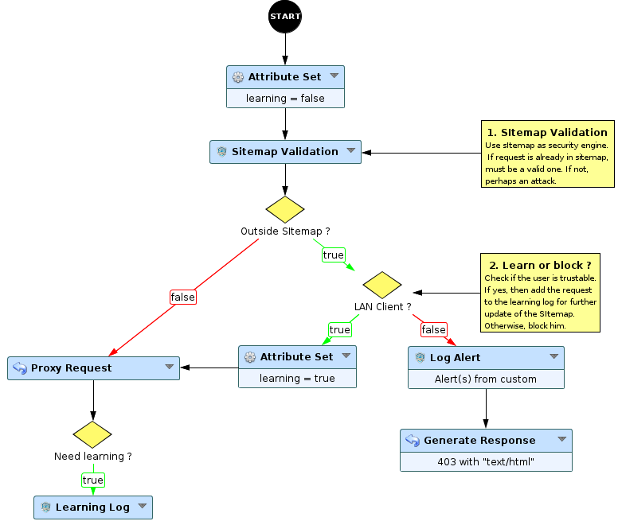
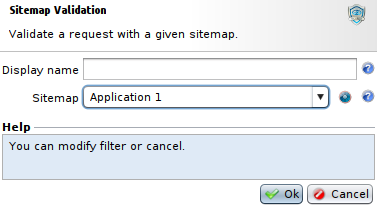
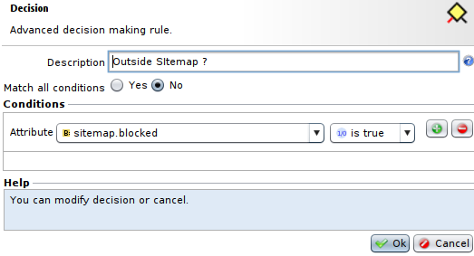
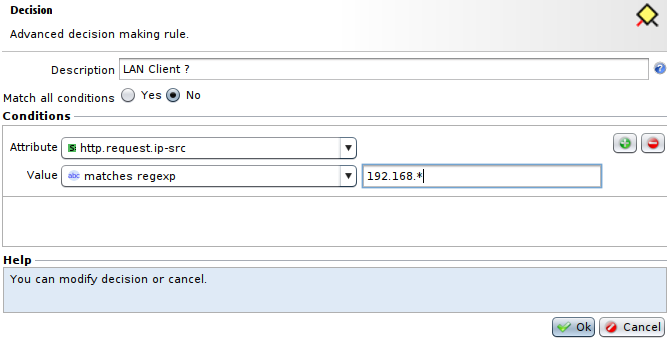
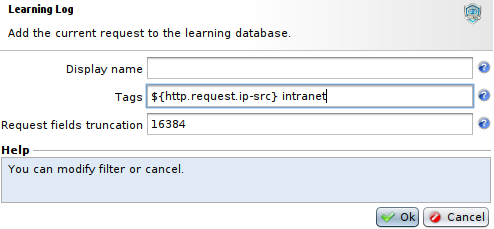
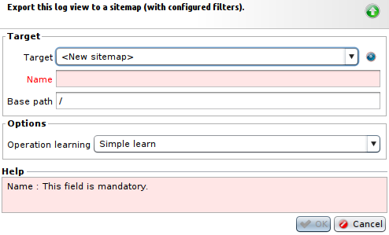

Protecting with Sitemap
=======================

* 1 [Presentation](#presentation)
* 2 [Workflow details](#workflow-details)
* 3 [Updating the sitemap](#updating-the-sitemap)

Presentation
------------

In the following use case, we use the sitemap and learning capabilities to protect a backend against unwanted accesses.

Workflow details
----------------

1.  Setting the attribute **Learning** to false, indicating default behaviour : do not learn
2.  The **Sitemap Validation** node then check the incoming request against the specified sitemap  
    
3.  Then, the condition checks if the request is valid or not  
    
4.  If the request is valid, proceed with proxy request
5.  If not valid, another condition checks if the client is trustable (for this use case : coming from 192.168.0.0/16)  
    
6.  If the client is trustable, set the learning attribute to true and then proceed to proxy request
7.  If the client is not trustable, block him
8.  A condition after the proxy request will check if learning is required
9.  If so, the **Learning Log** node will add the request to the learning log database  
    

Updating the sitemap
--------------------

The learning log node only send a log to the learning logs database. To update your sitemap, you can go to **Alert & Reporting > Learning Logs** and use the **Export to sitemap** button.

It will open a form with the following fields: 

*   **Target:** the target sitemap in which we are going to learn security logs. You can choose the item **<New sitemap>** to create a new sitemap on the fly.
*   **Name:** the name of the new sitemap.
*   **Base path:** the base path of the new sitemap.
*   **Operation learning:** allows to configure the way the operations (HTTP methods) are learned. In **Simple learning"**mode, we learn each found method specifically. In **Force ACCEPT-ALL** mode, we learn with forced ACCEPT-ALL methods. 
*   **Clear content:** to clear the content of the selected sitemap before updating it with learning logs.

Finally, **Apply** your tunnel to use the new version of the siteamp.
