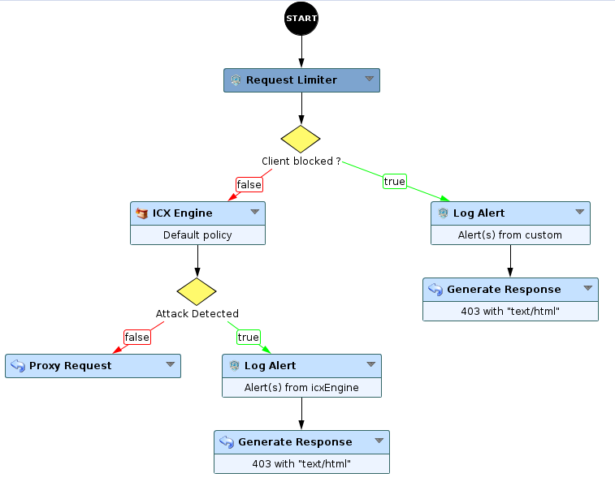
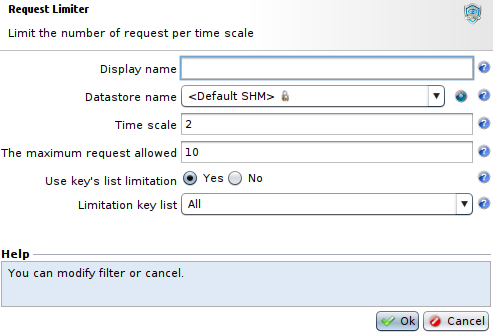
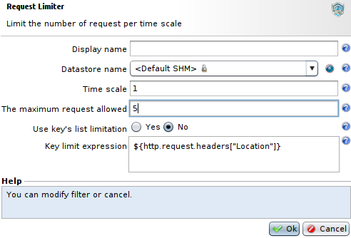

Request Limiter - DOS Application Layer
=======================================

* 1 [Presentation](#presentation)
* 2 [Backup](#backup)
* 3 [Reminder](#reminder)
* 4 [Usage](#usage)
* 5 [Benefits](#benefits)
* 6 [Disadvantages and limits](#disadvantages-and-limits)

Presentation
------------

The **Request Limiter** node, available within a workflow, allows you to limit the number of requests to a resource or an application during a limited period.

Backup
------

Download the use case backup: [Request Limiter.backup](./backup/Request%20Limiter.backup)

Reminder
--------

By default, there is no restriction on the number of incoming requests.
And the WAF only allows protection of applications against DOS on layer 7, DOS on network layer 4 must be detected and controlled upstream of the WAF.

Usage
-----

Add a Request Limiter node within a workflow before security engine to avoid unnecessary security check.

For instance, here is the configuration of a Request Limiter node with a maximum of 10 requests in 2 seconds that will check
source IP, session and cookies.

You can also check for specific information from the request. Here is a configuration with a maximum of 5 requests per second for requests containing a **Location** header.

Benefits
--------

*   Protects applications against flood by limitating the number of requests by user, containing attacks or not.
*   Can limit CPU usage of some nodes, like the ICX Security Engine node if the Request Limiter node is acting before.

Disadvantages and limits
------------------------

Have to be well sized according to the application to avoid blocking legitimate users.

Example: loading many elements on one page (css, javascript, images...). One request can easily load 10 elements so 11 requests passing through the WAF.
