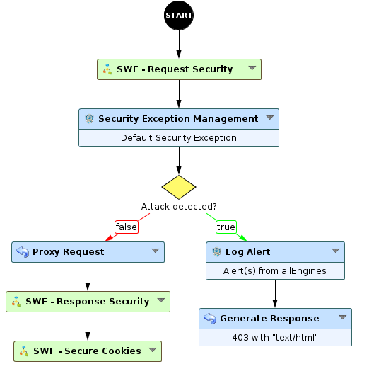
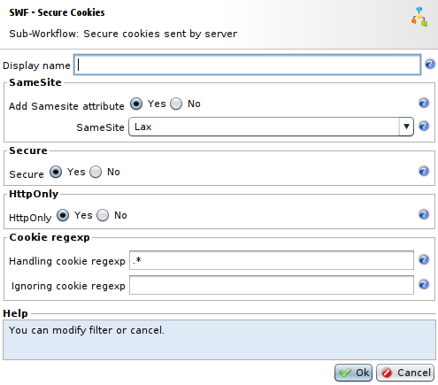
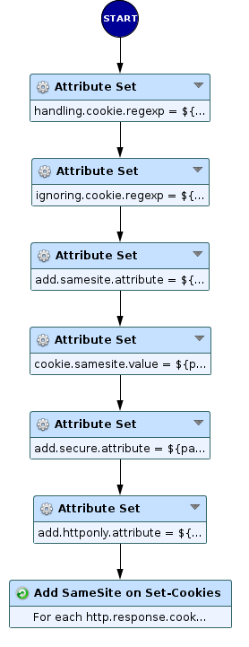
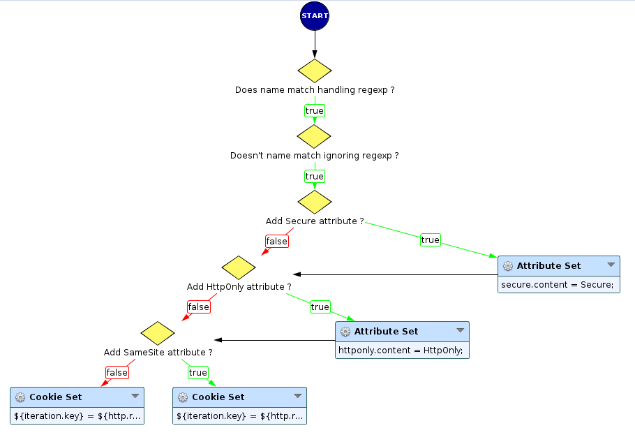

Secure Cookies
==============

* 1 [Presentation](#presentation)
* 2 [Backup](#backup)
* 3 [SWF - Secure Cookies](#swf-secure-cookies)
    * 3.1 [Set-Cookie security attributes](#set-cookie-security-attributes)
    * 3.2 [Sub-Workflow](#sub-workflow)
    * 3.3 [Settings](#settings)
    * 3.4 [How does this Workflow operate?](#how-does-this-workflow-operate)

Presentation
------------

The HTTP header **Set-Cookie** is used to send a cookie from the server to the user, to allow user to send them back later to the server. Hence, these cookies can hold numerous informations that should remain secret and so should be secured, to avoid attacks like CSRF or XSS. Note that for each cookie send from the server to the user, a **Set-Cookie** header is set, so multiple **Set-Cookie** headers can be present in the response.

For instance, a **Set-Cookie** header can look like this: 

`Set-Cookie: <cookie-name>=<cookie-value>; Domain=<domain-value>; SameSite=Lax; Secure; HttpOnly`.

Backup
------

The sub-workflow **SWF - Secure Cookies** can be found here [SWF - Secure Cookies](./backup/Secure%20Cookies.backup)

SWF - Secure Cookies
--------------------

### Set-Cookie security attributes

The **Set-Cookie** HTTP header can have several security attributes: 
* **SameSite**: this attribute allows to declare if the cookie has to be restricted to same-site context or not. It can have three possible values:
	* **Lax**: cookies are not sent on normal cross-site sub-requests but will be sent when a user is navigating to the origin site. This is the default value if the **SameSite** attribute is not present.
	* **Strict**: cookies will only be sent in a first-party context and won't be sent along with requests initiated by third party websites.
	* **None**: cookies will be sent in all contexts. In this case **Secure** flag has to be added too.
* **Secure**: this flag prevents cookie to be send using HTTP scheme, except on localhost. It will be added if the cookie comes from an HTTPS connection.
* **HttpOnly**: this flag forbids JavaScript to access the cookie, for instance with the **Document.cookie** property.

### Sub-Workflow

This node must be placed after the **Proxy request** node to modify the **Set-Cookie** headers from the backend response.

### Settings

* The field **Add SameSite attribute** is a boolean that allows you to choose to add a specific **SameSite** attribute to **Set-Cookie** headers. If set to `Yes`, it will let you choose between possible values: `Lax`, `Strict` or `None` with the field **SameSite**.
* The field **Secure** is a boolean allowing to choose to add **Secure** flag to **Set-Cookie** headers or not.
* The field **HttpOnly** is a boolean that allows to add **HttpOnly** flag to **Set-Cookie** headers or not.
* The field **Handling cookie regexp** is a regular expression that represents cookies name on which security attributes have to be added.
* The field **Ignoring cookie regexp** is a regular expression that represents cookies name on which security attributes shouldn't be added.

Note that if **SameSite** value is set to `None`, **Secure** attribute will be automatically added if the HTTP connection is secured (HTTPS).

### How does this Workflow operate?

The sub-workflow **SWF - Secure Cookies** will iterate over the response cookies table using **Foreach** node on **SWF Foreach - Secure Cookies** iterable sub-workflow.

 This iterable sub-workflow will add the different attributes according to parameters selected in the main sub-workflow.
