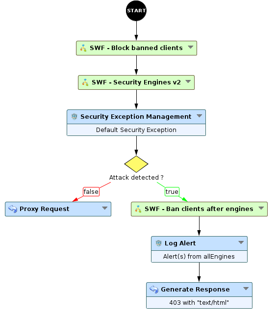
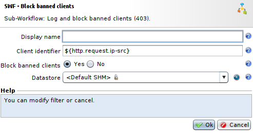
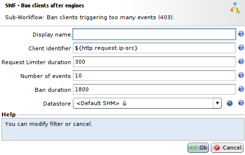

Temporary ban after several alerts
==================================

* 1 [Presentation](#presentation)
* 2 [Backup](#backup)
* 3 [Implementation example](#implementation-example)
* 4 [Sub-Workflows parameters](#sub-workflows-parameters)
    * 4.1 [SWF - Block banned clients](#swf-block-banned-clients)
    * 4.2 [SWF - Ban clients after engines](#swf-ban-clients-after-engines)
* 5 [Logs](#logs)

Presentation
------------

This Workflow **Temporary IP ban after several alerts** and two Sub-Workflows (**SWF - Block banned clients** and **SWF - Ban clients after engines**) allow to temporarily block every requests from a client having raised a number of alerts in an given period.

Backup
------

You can download these Workflows here: [Temporary IP ban after several alerts.backup](./backup/Temporary%20IP%20ban%20after%20several%20alerts.backup).

Keep in mind that this Workflow uses **Default Security Exception** configuration, hence you should change it and select your own **Security Exception Configuration** during backup.

After upload, the two Sub-Workflows can be found in the **Security** section.

Implementation example
----------------------

This Workflow **Temporary IP ban after several alerts** principally uses these two Sub-Workflows:
1. **SWF - Block banned clients** upstream from **SWF - Security Engines v2** Sub-workflow that will block requests from banned clients.
2. **SWF - Ban clients after engines** downstream from **SWF - Security Engines v2** Sub-workflow that will determine clients that should be banned.

Sub-Workflows parameters
------------------------

### SWF - Block banned clients

* The field **Client Identifier** contains information to identify the client. Usually it uses his IP address, it can also contain `${http.request.headers[‘X-Forwarded-For’]}` if client is going through proxies.
* The field **Block banned clients** allows to choose if banned clients should be blocked or not.
* The field **Datastore** allows to choose the **Datastore** that will contain information of banned clients. It's possible to create one from this interface.

### SWF - Ban clients after engines

* The field **Client Identifier** contains information to identify the client. Usually it uses his IP address, it can also contain `${http.request.headers[‘X-Forwarded-For’]}` if client is going through proxies. The same information from the first Sub-Workflow should be given.
* The field **Request Limiter duration** defines the duration, in seconds, during which security events will be counted.
* The field **Number of events** contains the number of events before triggering the ban.
* The field **Ban duration** contains the duration, in seconds, during which a client will be banned.
* The field **Datastore** allows to choose the datastore that will contain information of clients to ban. It's possible to create one from this interface, but the same information from the first Sub-Workflow should be given.

Keep in mind that **Ban duration** value should be higher than the duration defined in the **Request Limiter duration** field.

Logs
----

In the Sub-Workflow **SWF - Block banned clients**, logs are customised, it's possible to modify them in the **Log Alert** node. Currently, if a banned client tries to submit a request, this action will be logged in **Security Logs**. The message will be the following : The client identified by `${params.client.id}` is banned.

For the other Sub-Workflow **SWF - Ban clients after engines**, if a client is banned because he sent too many requests raising alerts, it will log this action in **Security Logs**. The message will be the following : The client identified by `${params.client.id}` has been banned. It can also be modified in the **Log Alert** node.

In both cases, `${params.client.id}` represents here the **Client identifier** field set in **SWF - Block banned clients** and **SWF - Ban clients after engines** Sub-Workflows parameters.
