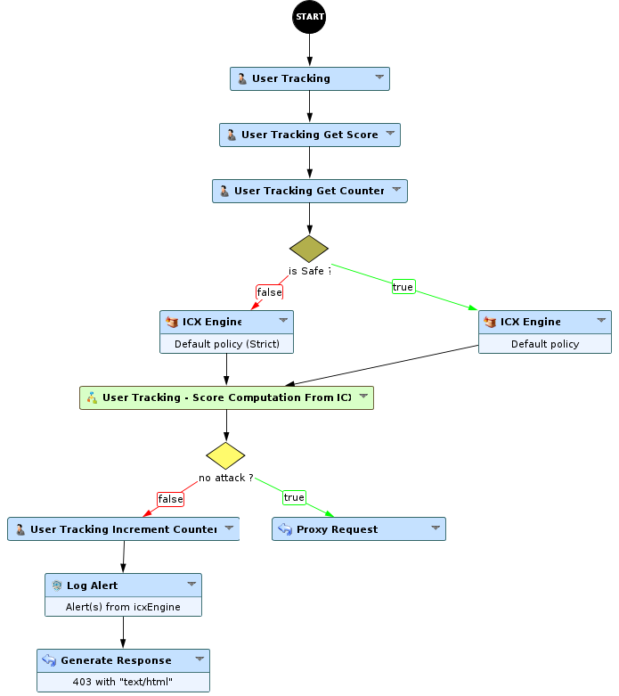
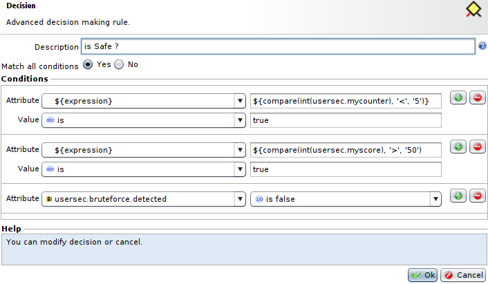
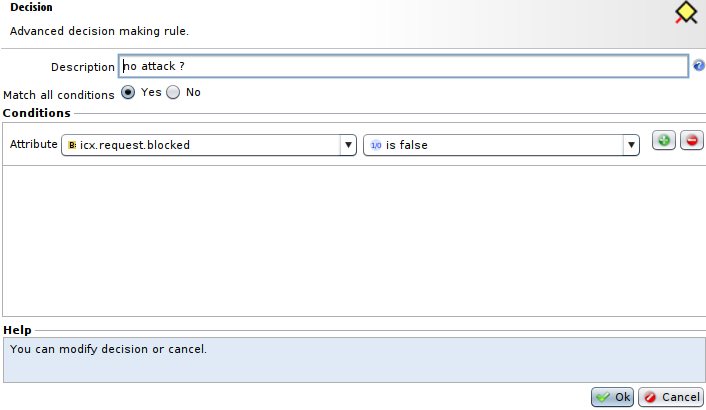

User Reputation Scoring with ICX and attacks counters
=====================================================

* 1 [Presentation](#presentation)
* 2 [Backup](#backup)
* 3 [Usage](#usage)

Presentation
------------

In the following use case, we use the tracking and scoring capabilities to apply a different security policy to our visitor, depending on their behaviour.

Backup
------

Download the use case backup here: [User Reputation Scoring with ICX and attacks counters.backup](./backup/User%20Reputation%20Scoring%20with%20ICX%20and%20attacks%20counters.backup)

Usage
-----

This workflow executes as follows :

1.  The **User Tracking** node identifies the visitor and provides its information
2.  The **User Tracking Get Score** node retrieves the score and set it in a custom attribute (usersec.score)
3.  The **User Tracking Get Counter** node retrieves the attack counter and set it in a custom attribute (usersec.mycounter)
4.  Then, the condition checks the score to decide which ICX security engine to use  
      
    1.  Counter < 5 : it uses a default policy
    2.  Counter >= 50 : it uses a default policy in strict mode
    3.  Score > 50 : it uses a default policy
    4.  Score <= 50 : it uses a default policy in strict mode  
          
        
5.  Then, both cases fall into the "Score Computation From ICX" Subworkflow to update the score
    1.  In case of attack, the score is divided by 3
    2.  In other case, the score is incremented by 3  
          
        
6.  The next condition checks if an attack was detected  
    
7.  1.  If an attack is detected, the **User Tracking Increment Counter** node will increment by 1 the counter retrieved previously (step 3). Then the workflow will proceed as usual (log alert and return error on attacks).
    2.  In other case, the visitor request is forwarded to the backend.