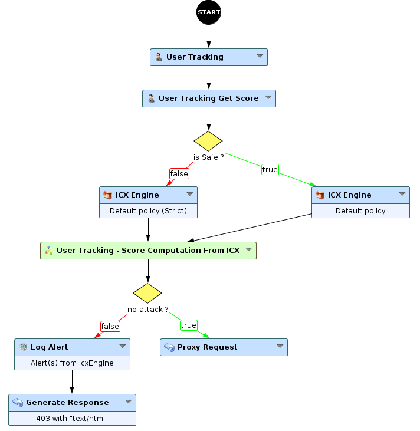
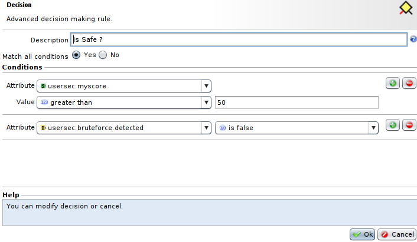
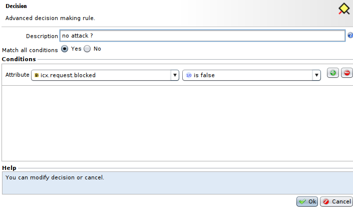

User Reputation Scoring with ICX
===============================

* 1 [Presentation](#presentation)
* 2 [Backup](#backup)
* 3 [Usage](#usage)

Presentation
------------

In the following use case, we use the tracking and scoring capabilities to apply a different security policy to our visitor, depending on their behaviour.

Backup
------

Download the use case backup here: [Use case 6.5 - User Reputation Scoring with ICX.backup](./backup/User%20Reputation%20Scoring%20with%20ICX.backup)

Usage
-----

This workflow executes as follows:

1.  The **User Tracking** node identifies the visitor and provides its information
2.  The **User Tracking Get Score** node retrieves the visitor score and sets it in a custom attribute, here **my.usersec.score**
3.  Then, the condition checks the score to decide which ICX security engine to use 
      
    1.  Score > 50: it uses a default policy
    2.  Score <= 50: it uses a default policy in strict mode  
          
        
4.  Then, both cases fall into the **Score Computation From ICX** Sub-Workflow to update the score
    1.  In case of attack, the score is divided by 3
    2.  In other case, the score is incremented by 3  
          
        
5.  The next condition checks if an attack was detected and proceed as usual (log alert and return error on attacks or forward the visitor request to the backend)  
    