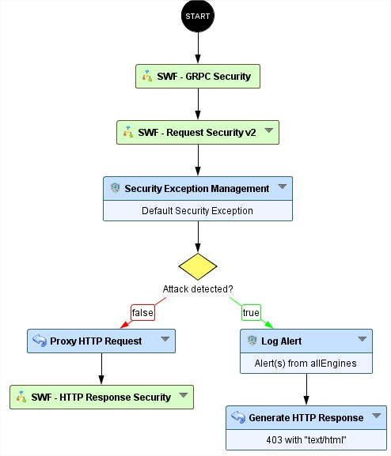
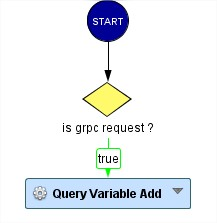

gRPC protection
=====================================

* 1 [Presentation](#presentation)
* 2 [Backup](#backup)
* 3 [Context](#context)
* 4 [Attack vectors](#attack-vectors)
* 5 [How to prevent gRPC attacks?](#how-to-prevent-grpc-attacks)
* 6 [Limitations](#limitations)
* 7 [Solution description](#solution-description)
    * 7.1 [SWF - gRPC Protection](#swf-grpc-protection)

Presentation
------------

gRPC (Google Remote Procedure Call) is a modern, high-performance communication protocol built on HTTP/2 and Protocol Buffers (Protobuf). It is widely used in microservices architectures for its efficiency, support for streaming, and strong typing.

Despite its binary format and structured schema, gRPC is not immune to traditional application-layer threats. Classic injection attacks—such as SQL injection, command injection, and deserialization attacks—can still be executed through gRPC payloads if input validation and sanitization are not properly enforced at the application level.

For more details, see:

*   [https://grpc.io/docs/](https://grpc.io/docs/)
*   [https://escape.tech/blog/how-to-secure-grpc-apis/](https://escape.tech/blog/how-to-secure-grpc-apis/)

Backup
------

Sub-Workflow can be downloaded here: [SWF - gRPC Protection.backup](./backup/SWF%20-%20gRPC.backup).

The Sub-Workflow will soon be available by default.

Context
-------

Modern microservices architectures increasingly rely on gRPC for internal and external service communication due to its efficiency, strong typing, and support for streaming over HTTP/2. As adoption grows, so does the need to secure gRPC endpoints against common application-layer threats.

While gRPC uses Protocol Buffers for structured, binary-encoded messaging, it does not inherently prevent malicious input. Attackers can exploit gRPC interfaces to deliver classic injection payloads.

Attack vectors
--------------

Although gRPC uses structured, binary-encoded messages via Protocol Buffers, it remains susceptible to traditional application-layer attacks when input validation is insufficient. Attackers can craft malicious gRPC requests that exploit vulnerable service methods by embedding payloads within message fields.

For example, a gRPC method accepting user input—such as a search query, file path, or serialized object—can be targeted with:

*   SQL Injection: Injecting SQL commands into string fields to manipulate backend databases.
*   Command Injection: Supplying shell commands in parameters that are later passed to system calls.
*   Deserialization Attacks: Sending manipulated serialized objects to trigger unsafe deserialization logic.
*   Authentication Bypass: Exploiting misconfigured or exposed gRPC methods that lack proper access control.

These attacks are often harder to detect due to the binary nature of Protobuf and the persistent, multiplexed nature of HTTP/2 streams. Without decoding and inspecting the payloads, traditional WAFs may miss these threats entirely.

How to prevent gRPC attacks?
----------------------------

Securing gRPC services requires a combination of protocol-aware inspection, strict input validation, and robust access control. Here are key strategies to prevent gRPC-based attacks:

*   Deep Protocol Inspection

Use a WAF or security gateway capable of decoding HTTP/2 and Protobuf messages. This allows inspection of method calls and message fields for malicious patterns, even in binary-encoded traffic.

*   Input Validation and Sanitization

Validate all incoming data against expected formats and constraints. Apply strict schema validation on Protobuf messages to prevent injection attacks and malformed payloads.

*   Authentication and Authorization

Enforce strong authentication (e.g., mTLS, OAuth2) and fine-grained authorization for each gRPC method. Avoid exposing internal or sensitive methods to unauthenticated clients.

*   Rate Limiting and Resource Controls
Protect against abuse of streaming and long-lived connections by applying rate limits, timeouts, and maximum message sizes.

*   Logging and Monitoring

Log gRPC method calls and payloads (where possible) for anomaly detection and forensic analysis. Monitor for unusual patterns such as repeated method calls or malformed messages.

*   Secure Development Practices

Educate developers on secure coding practices for gRPC, including safe deserialization, avoiding command execution from inputs, and using trusted libraries.

*   Regular Testing and Auditing

Perform security testing (e.g., fuzzing, penetration testing) on gRPC endpoints to identify vulnerabilities. Keep dependencies and gRPC libraries up to date.

Limitations
-----------

While this sub-workflow provides effective protection against injection-based attacks in gRPC traffic, it is important to understand its scope and boundaries:

*   No Authorization Enforcement

This workflow does not assess or enforce user permissions or access control. It assumes that authentication and authorization mechanisms are handled upstream or by the application itself. As such, it cannot detect privilege escalation, unauthorized method access, or role-based access violations.

*   Injection-Focused Detection

The primary focus is on identifying and blocking injection attacks—such as SQL injection, command injection, and unsafe deserialization—within gRPC payloads. Other types of threats, such as business logic abuse or data leakage, are outside the scope of this workflow.

*   Protocol-Specific Coverage

The workflow is tailored for gRPC over HTTP/2 using Protocol Buffers. It may not provide full protection for gRPC implementations using alternative encodings or transport layers.

*   Limited Context Awareness

Detection is based on message content and structure, not on full session or user behavior context. Advanced evasion techniques that rely on multi-step logic or obfuscation may require complementary behavioral analysis tools.

Solution description
--------------------------

We provide a Sub-Workflow to mitigate attacks through gRPC protocol.

The first "SWF - gRPC Protection" has to be placed after the start node and before security engines (see figure below).

### SWF - gRPC Protection

This node does require any configuration:

#### How does this Workflow node operate?

The SWF will first check the method of the request:

*   It checks whether the request contains the Content-Type: grpc header.
*   It then stores the request body in a new variable to ensure it is processed by the ICX engine.