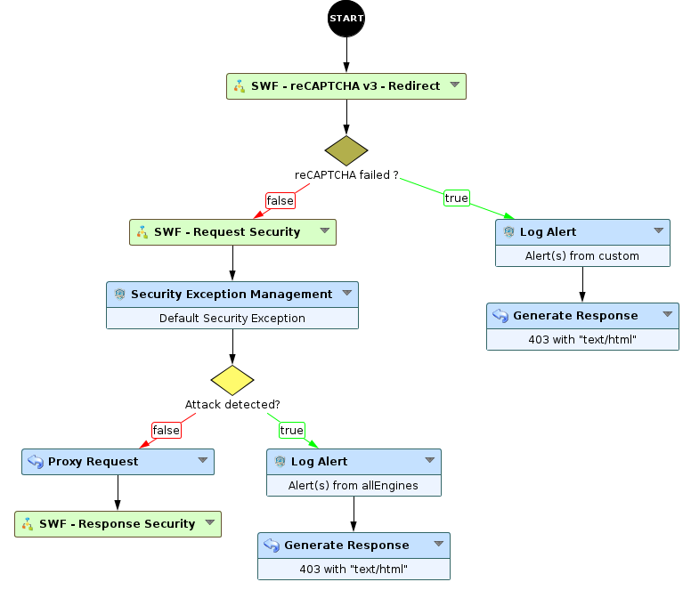
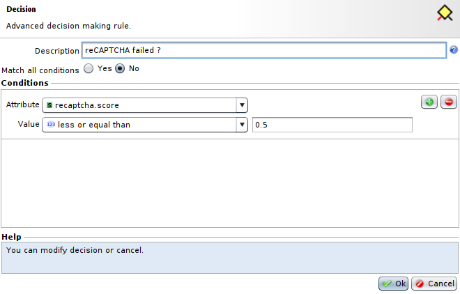

reCAPTCHA v3 as a security engine
=================================

* 1 [Presentation](#presentation)
* 2 [Backup](#backup)
* 3 [Usage as a security engine](#usage-as-a-security-engine)

Presentation
------------

This use case allows to use Google's reCAPTCHA v3 in your application as a security engine to ensure that you can sort between real humans joining your application and automated access by blocking any user with a reCAPTCHA score below a certain value. This use case includes two different implementations of reCAPTCHA v3, one with a direct redirection to the page the user asked for, and one where the user will have to click on a button to gain access to the desired page. It also includes the Sub-Workflow used in previously mentioned Sub-Workflows to implement Google's reCAPTCHA v3 API.

The documentation for the Sub-Workflows used in this use case can be found [here](../reCAPTCHA%20v3).

More information about Google's reCAPTCHA can be found [here](https://www.google.com/recaptcha/about/).

Backup
------

Backup can be downloaded here: [SWF - reCAPTCHA v3](../reCAPTCHA%20v3/backup/SWF%20-%20reCAPTCHA%20v3.backup).

This backup contains three Sub-Workflows:
* **SWF - reCAPTCHA v3 - API**: this Sub-Workflow implements reCAPTCHA v3 API, and is used inside following Sub-Workflows.
* **SWF - reCAPTCHA v3 - Redirection**: this Sub-Workflows implements reCAPTCHA v3 with an automatic redirection.
* **SWF - reCAPTCHA v3 - No redirection**: this Sub-Workflow implements reCAPTCHA v3 without an automatic redirection.

Usage as a security engine
--------------------------

You can place it right after the **Start** node followed with a decision node blocking request if the client failed the reCAPTCHA, as shown below:

And the **decision** node looks like this:

So, this Workflow will block and log any request having a reCAPTCHA's score less than or equal to `0.5`.
