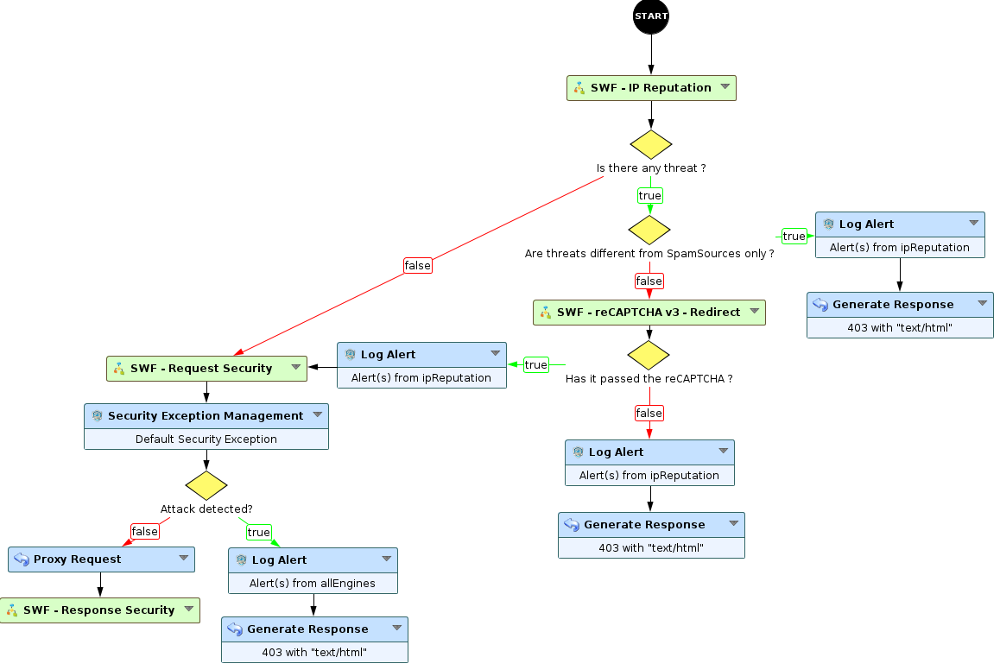
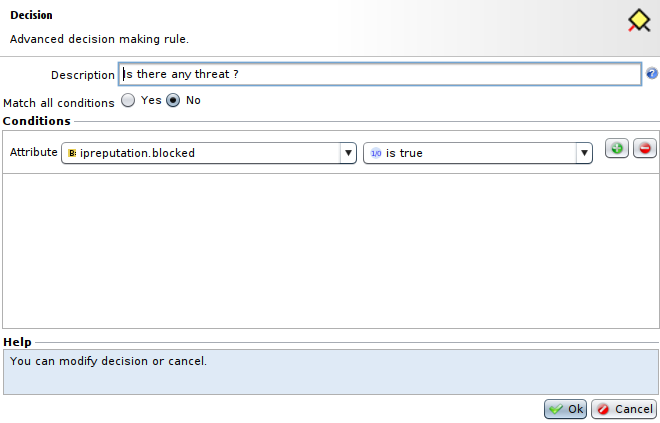
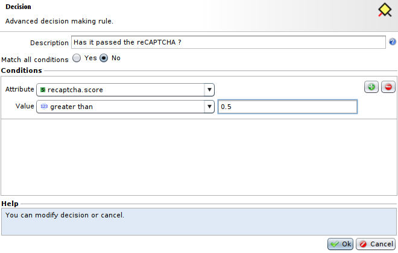

reCAPTCHA v3 with IP Reputation
===============================

* 1 [Presentation](#presentation)
* 2 [Backup](#backup)
* 3 [Usage with IP Reputation for a finer sorting](#usage-with-ip-reputation-for-a-finer-sorting)

Presentation
------------

This use case presents a way to use Google's reCAPTCHA v3 with IP Reputation in your application to sort users connecting more finely, depending on threats detected by IP Reputation and reCAPTCHA's results. The use case includes two different implementations of reCAPTCHA v3, one with a direct redirection to the page the user asked for, and one where the user will have to click on a button to gain access to the desired page.

The documentation for reCAPTCHA v3 Sub-Workflow and for the IP Reputation Sub-Workflow can be found here: [reCAPTCHA v3](../reCAPTCHA%20v3) and [IP Reputation](../IP%20Reputation).

More information about Google's reCAPTCHA can be found [here](https://www.google.com/recaptcha/about/).

Backup
------

Backup can be downloaded here: [SWF - reCAPTCHA v3](../reCAPTCHA%20v3/backup/SWF%20-%20reCAPTCHA%20v3.backup) and [IP Reputation](../IP%20Reputation/backup/SWF%20-%20IP%20Reputation.backup).

The backup for reCAPTCHA v3 contains three Sub-Workflows: 
* **SWF - reCAPTCHA v3 - Redirection**: this Sub-Workflows implements reCAPTCHA v3 with an automatic redirection.
* **SWF - reCAPTCHA v3 - No redirection**: this Sub-Workflow implements reCAPTCHA v3 without an automatic redirection.
* **SWF - reCAPTCHA v3 - API**: this Sub-Workflow implements reCAPTCHA v3 API, and is used inside previously mentioned Sub-Workflows.

The backup for IP Reputation contains one Sub-Workflow:
* **SWF - IP Reputation**: this Sub-Workflow allows the use of Webroot's IP Reputation to get information about threats related to the source IP address.

Usage with IP Reputation for a finer sorting
--------------------------------------------

We will use **SWF - reCAPTCHA v3** to check the user's legitimacy if the **SWF - IP Reputation** Sub-Workflow has detected that its source IP address was related to **spamSources** threat category only, among activated threat categories in **SWF - IP Reputation**.

* The **SWF - IP Reputation** Sub-Workflow, with **spamSources** category enabled, should be placed after **Start** node, followed by a **decision** node checking if threats have been detected. If so, the request will go to another **decision** node, otherwise it will be sent to a security engine.

* The **decision** node we mentioned previously will verify if the detected threats are different from **spamSources**. If so, we need to log and block the request, if not, it will send the request to a **SWF - reCAPTCHA v3** Sub-Workflow.

* Then, we need to add the **SWF - reCAPTCHA v3** Sub-Workflow (it can be **Redirect** or **No redirect**), followed by a **decision** node checking if the **reCAPTCHA** has failed. If it has failed, we have to log and block the request, otherwise send the request to a **Log Alert** node using **IP Reputation** as **Security Engine** and **Send log to database** set as **No** to drop the request about **spamSources** threat.

