reCAPTCHA v3
============

* 1 [Presentation](#presentation)
* 2 [Backup](#backup)
* 3 [Prerequisites](#prerequisites)
	* 3.1 [Google's reCAPTCHA keys](#googles-recaptcha-keys)
	* 3.2 [Enabling DNS](#enabling-dns)
* 4 [SWF - reCAPTCHA v3 - API](#swf-recaptcha-v3-api)
	* 4.1 [Settings](#settings)
	* 4.2 [Provided attributes](#provided-attributes)
	* 4.3 [Sub-Workflow content](#sub-workflow-content)
* 5 [Sub-Workflows examples](#sub-workflows-examples)
	* 5.1 [Settings](#settings)
	* 5.2 [Provided attribute](#provided-attribute)
	* 5.3 [Sub-Workflows content](#sub-workflows-content)
		* 5.3.1 [Generate Response node for automatic redirection](#generate-response-node-for-automatic-redirection)
		* 5.3.2 [Generate Response node with no automatic redirection](#generate-response-node-with-no-automatic-redirection)

Presentation
------------

This use case allows to add Google's reCAPTCHA v3 to your application to be able to distinguish between real humans joining your application and automated access. The use case includes two different implementations of reCAPTCHA v3, one with a direct redirection to the page the user asked for, and one where the user will have to click on a button to gain access to the desired page.

More information about Google's reCAPTCHA can be found [here](https://www.google.com/recaptcha/about/).

Backup
------

Backup can be downloaded here: [SWF - reCAPTCHA v3](./backup/SWF%20-%20reCAPTCHA%20v3.backup).

This backup contains three Sub-Workflows:
* **SWF - reCAPTCHA v3 - API**: this Sub-Workflow implements reCAPTCHA v3 API, and is used inside following Sub-Workflows.
* **SWF - reCAPTCHA v3 - Redirect**: this Sub-Workflows implements reCAPTCHA v3 with an automatic redirection.
* **SWF - reCAPTCHA v3 - No redirect**: this Sub-Workflow implements reCAPTCHA v3 without an automatic redirection.

Prerequisites
-------------

### Google's reCAPTCHA keys

First of all, to be able to add reCAPTCHA to your application you will need to get keys from Google reCAPTCHA services:
* A **Site Key** that should be placed in your HTML code to be sent to users.
* A **Secret key** that will be used for communication between your site and reCAPTCHA service, it has to be kept secret.

To get these keys, you will need to go on [reCAPTCHA's admin page](https://www.google.com/recaptcha/admin/create).
Then, you will need to connect to Google, it will redirect you to the page where you can create keys for your domain names.

In this page:
* Select a name for this project.
* Choose **reCAPTCHA version 3**.
* Select **domain names** for your applications.
* You have the option to select other **email addresses** for the owners.
* Read and accept reCAPTCHA **Terms of Service**.
* You can also choose to receive alerts from Google in case of abnormal traffic.

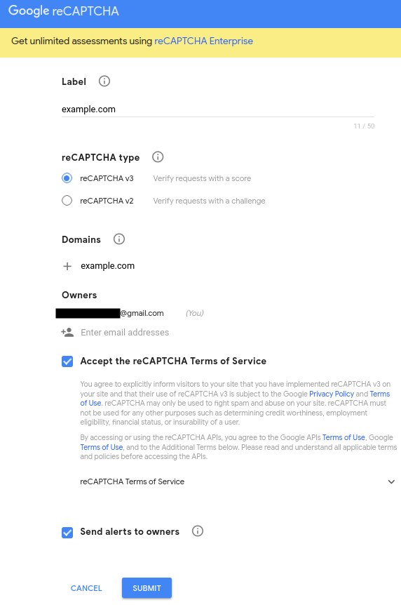

Finally, you will be redirected to a page with the keys for you domain names. 

|:warning: Note that Google's reCAPTCHA v3 offer is free up to 1 million assessments per month, and that this offer may change in the future|
--------------------------------------------------------------------------------------------------------------------------------------------|

### Enabling DNS

Then, enabling DNS is mandatory to reach Google (currently with **www.google.com**). To do so, go to **Setup > Boxes**, select your **Management Box**, go to the **DNS** tab and tick **Enable DNS**.

Finally, enter Primary and Secondary DNS addresses. You can keep default settings values or change them for specific needs.

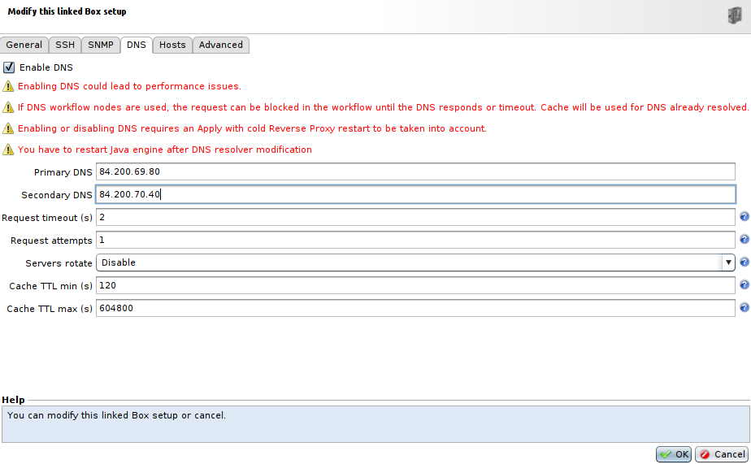

SWF - reCAPTCHA v3 - API
------------------------

### Parameters

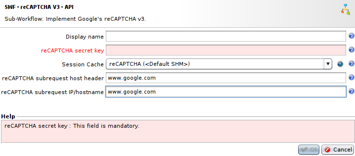

* The field **reCAPTCHA secret key** is the secret key for your application generated earlier in your reCAPTCHA admin page.
* The field **Session Cache** is the **Session Cache Profile** to use to store reCAPTCHA's results for the users, it can be created from this menu or from **Policies > Workflows > Sessions Cache Profiles**.
* The field **reCAPTCHA subrequest host header** should contain the **Host** header for the subrequest made to check user's token.
* The field **reCAPTCHA subrequest IP/hostname** should contain the IP address or the hostname of the target for the subrequest made to check user's token.

### Provided attributes

The **SWF - reCAPTCHA v3 - API** Sub-Workflow provides two attributes:

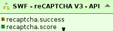

* The attribute **recaptcha.success** is a boolean representing if the user ran through reCAPTCHA without error, not if the user failed the reCAPTCHA or not.
* **recaptcha.score** represents the reCAPTCHA score obtained by the user, it ranges between 0 and 1.0, the lower it is the more likely it is to be a bot. A decision can be taken on the client score to trigger actions (block, redirection, new challenge, ...). By default, you can consider that a client is safe when the score is upper than 0.5. For more details about the score, see [interpreting the score](https://developers.google.com/recaptcha/docs/v3#interpreting_the_score).

### Sub-Workflow content

This Sub-Workflow implements the Google's reCAPTCHA v3 API to send user's token to reCAPTCHA services and verify it.

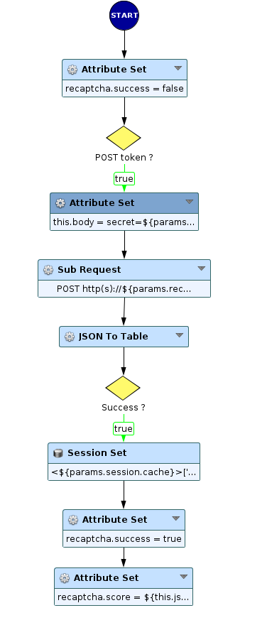

* Firstly, we set the attribute **recaptcha.success**, representing if the run of the reCAPTCHA recieved any error, as the value **false**.
* Then, we verify if the user sent a token in his request. If so, we continue in the Sub-Workflow and create an attribute **this.body** which will contain the content of the body for the request, i.e. the **secret key** for the communication between application and reCAPTCHA services and the **token** sent by user.
* Next, comes the core part of the Sub-Workflow where we use the **Sub Request** node to contact reCAPTCHA services to check user's token.
	* The fields **Connected IP/hostname** and **Host** representing the server to contact and the host header respectively should use the parameters sent to the Sub-Workflow.
	* The field **Connected Port** is set at 443 for HTTPS, and **Use SSL** is set at **Yes**.
	* The field **Method** for the request needs to be set at **POST**.
	* The field **URL** represents the target URL for the request, for now it needs to be `/recaptcha/api/siteverify` to reach reCAPTCHA services.
	* The field **Content Type** is used for the header `Content-Type` in the request and has to be set at `application/x-www-form-urlencoded`.
	* The field **Body** contains the body for the request, here it is the attribute **this.body** created earlier.
	* Other fields **Cookies** and **Headers** can be left empty in this use case.
* After that, we retrieve the body of the response to the sub-request in a table, using **JSON to Table** node.
* Finally, if it is a success, we will store this result for the user in the session cache passed in parameters to keep tracks of it. And then, we set the provided attributes **recaptcha.success** and **recaptcha.score**.

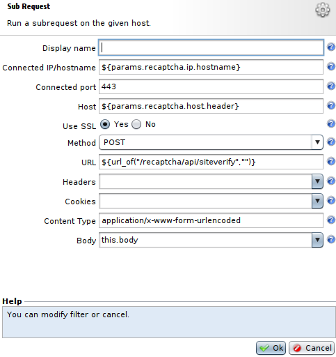

Sub-Workflows examples
----------------------

This examples will show you how to use the **SWF - reCAPTCHA v3 - API** Sub-Workflow to simply implement Google's reCAPTCHA v3 in your application. We have two differents cases, **SWF - reCAPTCHA v3 - Redirection** with an automatic redirection and **SWF - reCAPTCHA v3 - No redirection** without this redirection.

### Settings

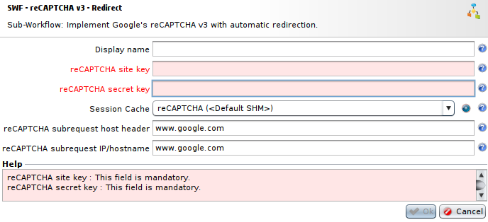

For both Sub-Workflows, settings are the same:
* The field **reCAPTCHA site key** is the site key previously created on your reCAPTCHA admin page.
* The field **reCAPTCHA secret key** is the secret key previously created on your reCAPTCHA admin page.
* The field **Session Cache** is the **Session Cache Profile** that will store users reCAPTCHA's results. You can create one from this settings menu or in **Policies > Workflows > Sessions Cache Profiles**.
* The field **reCAPTCHA subrequest host header** should contain the **Host** header for the subrequest made to check user's token.
* The field **reCAPTCHA subrequest IP/hostname** should contain the IP address or the hostname of the target for the subrequest made to check user's token.

### Provided attribute

Both Workflows provide only one attribute:
* **recaptcha.score** represents the reCAPTCHA score obtained by the user, it ranges between 0 and 1.0, the lower it is the more likely it is to be a bot. A decision can be taken on the client score to trigger actions (block, redirection, new challenge, ...). By default, you can consider that a client is safe when the score is upper than 0.5. For more details about the score, see [interpreting the score](https://developers.google.com/recaptcha/docs/v3#interpreting_the_score).

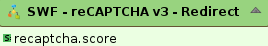

### Sub-Workflows content

Both Sub-Workflows are simple and don't contain a lot of different nodes. They also are really similar, the only difference being in the content of the **Generate Response** node. 

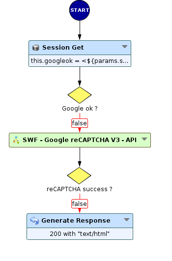

* In the first place, we check in the **Session Cache** coming from parameters if the user has already passed the reCAPTCHA or not.
* Then, if the user hasn't already passed the reCAPTCHA, we use the **SWF - reCAPTCHA v3 - API** Sub-Workflow to make the user pass the reCAPTCHA. In this node we need to use the Sub-Workflow's provided parameters as shown below:

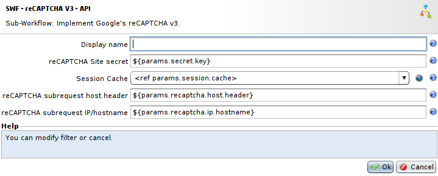

* If it is the first time this user comes to the application, the user won't have the token for **SWF - reCAPTCHA v3 - API** and he will quit the Sub-Workflow when the **decision** node will check his token. And because **recaptcha.success** would be set at **false**, the user will go to the **Generate Response** that will create the token, send it via an hidden form and redirect directly or not depending of the Sub-Workflow used. The content of this node follows [Google's documentation for reCAPTCHA v3 API](https://developers.google.com/recaptcha/docs/v3). This redirection will bring him to the **SWF - reCAPTCHA v3 - API** again with a valid token to pass the reCAPTCHA.

* If the user has a token but previously recieved errors during the reCAPTCHA, he will also go to the same **Generate Response** to get a new token (tokens for reCAPTCHA v3 have a lifetime of 2 min and can't be used multiple times) and will be redirected directly or not depending of the Sub-Workflow used to go through **SWF - reCAPTCHA v3 - API** again.

* Finally if the user already passed the reCAPTCHA successfully, the attribute **GoogleOk** in the **Session Cache** concerning this user should have the value **true**, allowing him to quit the Sub-Workflow directly.

#### Generate Response node for automatic redirection

As mentioned previously, the content of the **Generate Response** follows the Google's documentation about reCAPTCHA v3.

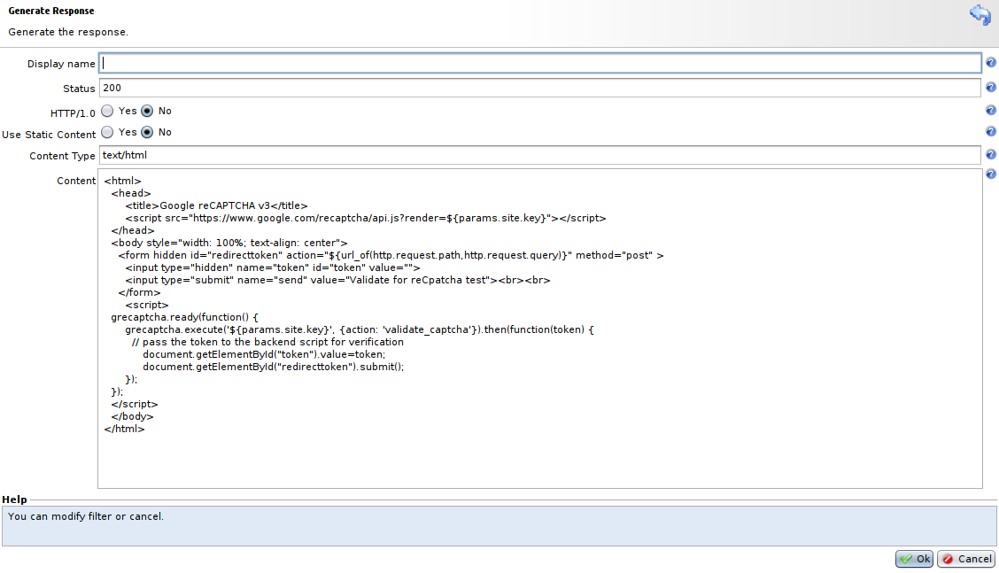

|:warning: Note that for this case with automatic redirection, the reCAPTCHA information won't be visible for users, and to respect Google's Terms of Use for reCAPTCHA v3, you will need to include reCAPTCHA branding in the user flow (reCAPTCHA logo is not mandatory as long as you inform users that the application use Google's reCAPTCHA with links to [**Privacy Policy**](https://policies.google.com/privacy?hl=en) and [**Terms of Service**](https://policies.google.com/terms?hl=en)).|
|-------------------------------------------------------------------------|

#### Generate Response node with no automatic redirection

The **Generate Response** node in this case is really similar to the previous one, it differs in the style added to the reCAPTCHA badge and most importantly in the script used to add the token in the form where this form is not sent automatically, allowing the user to click on a button to send the form with the token to forward the reCAPTCHA.

The page where you will have to click on for reCAPTCHA will look like this by default:

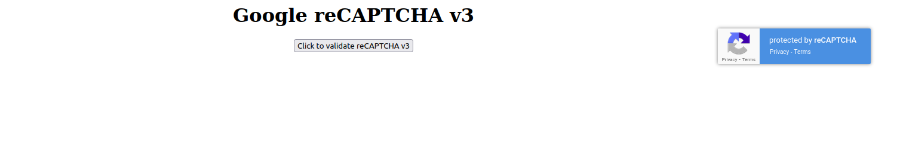

This page can be changed, but it has to be done in the **Generate Response** node in **SWF - reCAPTCHA v3 - No redirection**. And keep in my mind that elements concerning reCAPTCHA are mandatory, like import of Google's reCAPTCHA API, script to create user's token and form to send this token with proper redirection.

In the same way as for the **SWF - reCAPTCHA v3 - Redirection** example, you can remove Google's reCAPTCHA branding from this page, but it has to be visible somewhere in the user flow.
