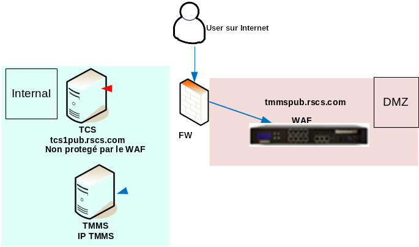
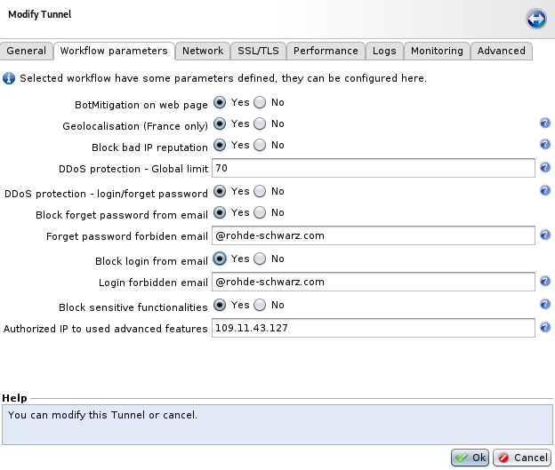

# Tixeo pack

1. [Introduction](#introduction)
2. [Architecture](#architecture)
3. [Installation](#installation)
4. [How to configure the Tixeo pack](#how-to-configure-the-tixeo-pack)

## Introduction

The Tixeo pack will help you quickly integrate and protect Tixeo, this pack will allow you to have a set a configuration that includes the possibility to custom advance functionalities of Tixeo, a set of security engine and false-positive.

Tixeo website: https://www.tixeo.com\
Tixeo Documentation: https://faq.tixeo.com/

Advanced functionalities:
* Block forgot password functionality for a specific mail domain,
* Block login password functionality for a specific mail domain,
* Allow sensitive functionalities like create-meeting, change account only for specific IP;

Security engine:
* BotMitigation,
* Geo-localization,
* IP Reputation,
* Rate limiting for global and sensitive endpoints (login & password forget);

In all cases, an _Extended API security_ license option is required. To verify if your license includes it, go to "Setup > Boxes > Licenses".

Pre-requisite:
* R&S WAF 6.5.6 or upper,
* Enterprise license,
* Extended API security license option,
* 1 tunnel;

## Architecture

Tixeo is using standard HTTPS only for the TMMS (Tixeo Meeting Management Server) which includes the webapp and API, the TCS (Tixeo Communication Server) is using proprietary protocol inside a TCP socket on port 443 and must not be connected to the WAF. The TCC (Tixeo Communication Client) is the client to organize and join meetings.

## Installation

The Tixeo pack is very quick to deploy and mostly configurable using the workflow parameter.

First, import the backup "Tixeo-pack" to your R&S WAF, restore all items then link the Workflow "TIXEO TMMS" to our tunnel.

Apply the tunnel linked to the Tixeo workflow.

## How to configure the Tixeo pack

The Tixeo pack is very easy to configure, you simply need to double-click on the tunnel and go to the workflow parameter tabs to see all the included feature:

The feature can also be directly customized from the workflow itself.

### Block login for specific mail domain

This option enhances the perimeter control using segregation by mail domain and forbid internal company users to login from internet.

If the mail domain is `@something.com`, it will be forbidden to login to TIXEO.

### Block forget-password for specific mail domain

This option enhances the perimeter control using segregation by mail domain but specific to the forget-password. It forbids internal company users to use the forget password feature from internet.

If the mail domain is `@something.com`, it will be forbidden to login to TIXEO.

### Limit DDoS on login & forget-password

This option add a security layer using application DDoS limiter to reduce the number of time a user can request a new password or try to login to TIXEO:
* The login is limited with specific DDoS protection:
  * 6 requests / minute / IP for light clients;
  * 3 requests / minute / IP for API clients;
* The forget-password is limited with specific DDoS protection:
  * 2 requests / minute / IP;

You can also add a global rate limiting that is applied on all web and API access.

### Allow Sensitive functionalities from specific IP

This option authorizes "sensitive functionalities" to be perform only from a specific IP (the public IP of the company for example). It authorizes administrative tasks.

This is the list of the different sensitive functionalities:
* updateUser,
* deleteUser,
* getMyDefaultMeetingInfos,
* validateMeetingInfos,
* createMeeting,
* makeCall,
* updateMeeting,
* stopMeeting,
* deleteMeeting,
* deleteMeetingWithoutSendingEmails,
* CancelMeeting,
* changeAppSetting,
* getAppSetting;