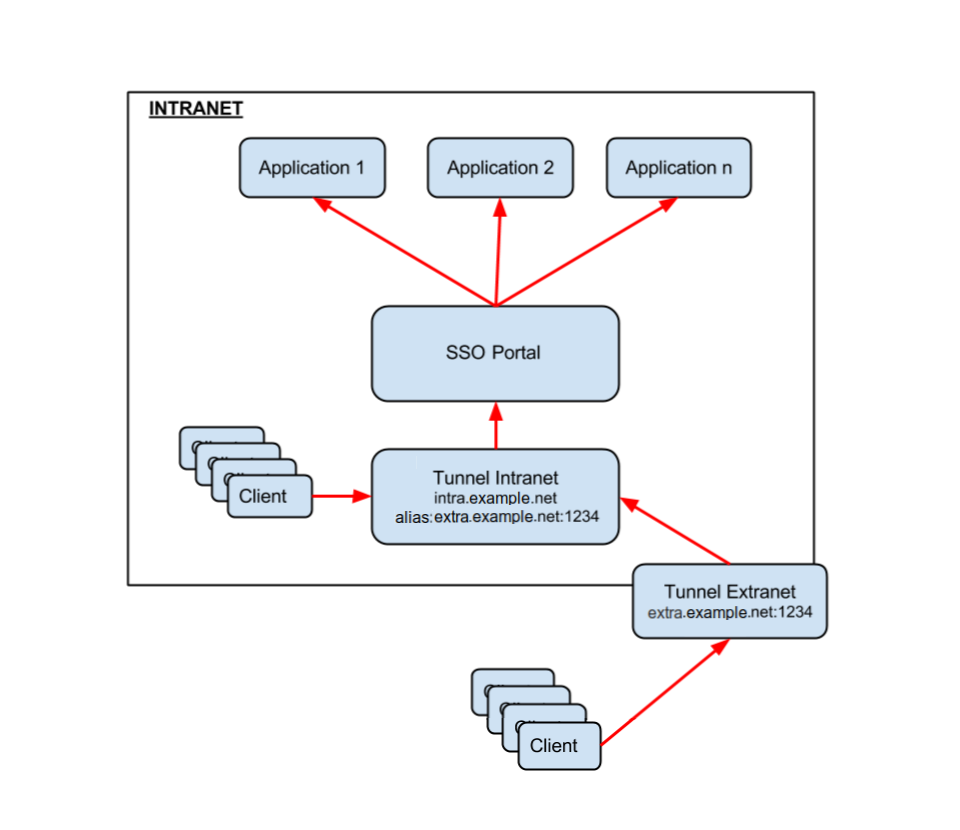
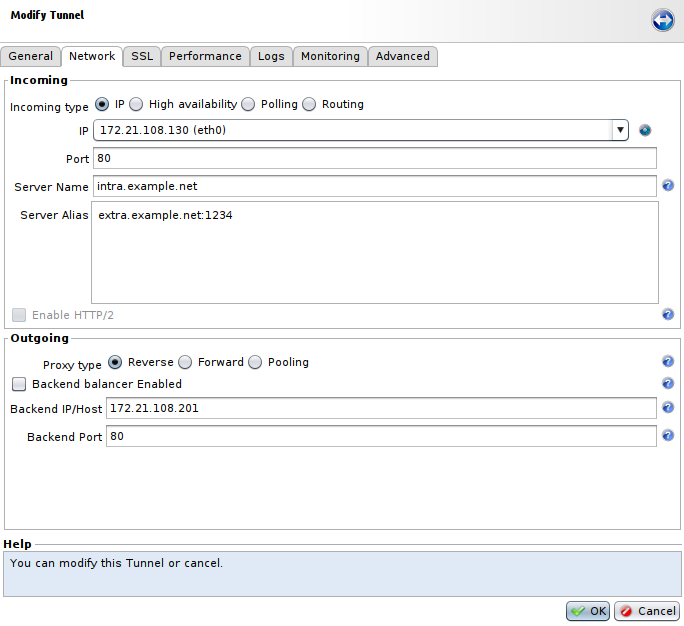
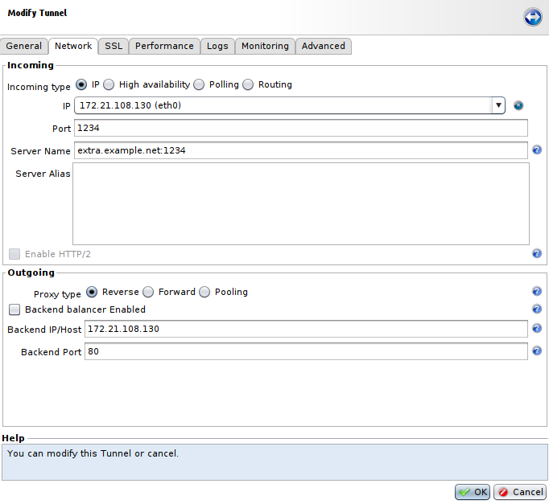

Proxy Chaining
==============

* 1 [Presentation](presentation#)
* 2 [Installing the Tunnel](#installing-the-tunnel)
    * 2.1 [Modifying the existing tunnel](#modifying-the-existing-tunnel)
    * 2.2 [Creating another tunnel for redirection](#creating-another-tunnel-for-redirection)
* 3 [Testing the tunnel](#testing-the-tunnel)

Presentation
------------

In this use case we will present how to allow access to an SSO portal used for authentication on an intranet from the outside using another hostname and a dedicated port.

Prerequisites
-------------

The following elements should be present and valid as a minimal configuration for this use case:

* An **RP (Reverse Proxy)** with the **Block unknown hostname** parameter enabled. To do so, go to **Setup > Reverse Proxies**, select your RP, and in **Advanced** tab, tick **Block** in **Requests on unknown hosts** section.
* A **Tunnel** configured for **SSO (Single Sign-On)** authentication. In this example we will set the **Server Name** at **intra.example.net** on the standard port 80. It will be referred as **intra.example.net** in the rest of the documentation.
* A functional **SSO** configuration with users and applications.

Installing the Tunnel
---------------------

### Modifying the existing tunnel

To make the Tunnel accept requests, we must give it the other name to which it will have to respond. To do that, click on the tunnel in the **Applications** view, then click **Modify**.

In the **Network** tab, in the **Server Alias** field, enter the new name: **extra.example.net:1234**. This new name contain the **hostname** that client outside of the intranet could use and the **port**, we have to include the port in the **Server Alias** because we are using **1234**, which is a non-standard port.

### Creating another tunnel for redirection

The external connection should be made via a new Tunnel that will redirect to the Tunnel **intra.example.net**. Since the goal is a redirection of the flow, the most important point in the configuration is the **Network** tab.

The parameters of the **Outgoing** part have to correspond to the **IP address** and **listening port** of **intra.example.net** Tunnel's **Incoming** part.

In the **Incoming** part, configure the **IP address** related to the hostname **extra.example.net** and using the **Server Alias's** defined port of **intra.example.net** Tunnel (ie. **1234**). Put **extra.example.net:1234** in the **Server Name** field.

Don't forget to **Apply** the new configuration after these modifications.

Testing the tunnel
------------------

The initial configuration must always be functional. You can test that by a simple connection from the intranet.

To validate access by the new Tunnel **extra.example.net:1234**, you need to position yourself outside the intranet network, then with a browser issue a request to the address: **http://extra.example.net:1234**. The SSO authentication page must be displayed and you need to be able to connect with a user.

| :warning: Take care with the browser cache during the tests. It’s preferable to switch to private browsing to avoid invalidating the tests.|
|--------------------------------------------------------------------------------------------------------------------------------------------|
