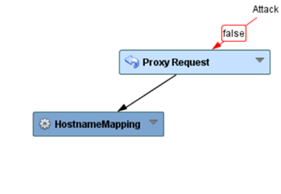
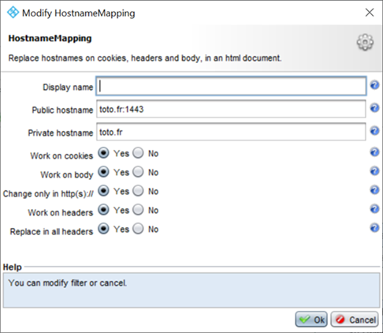

Incoming and outgoing port mismatch
===================================

Presentation
------------

In this use case we will present how to deal with tunnel port mismatch issue.
Suppose your incoming tunnel port set on 1443 and your outgoing port is the default 80.
In this configuration the links returned by the backend won't contain the expected port (1443) to client.

Fix this issue
--------------
To fix this issue you have to add a HostnameMapping node to your workflow, after the proxy request:

Then configure the added node to map the expected port:

