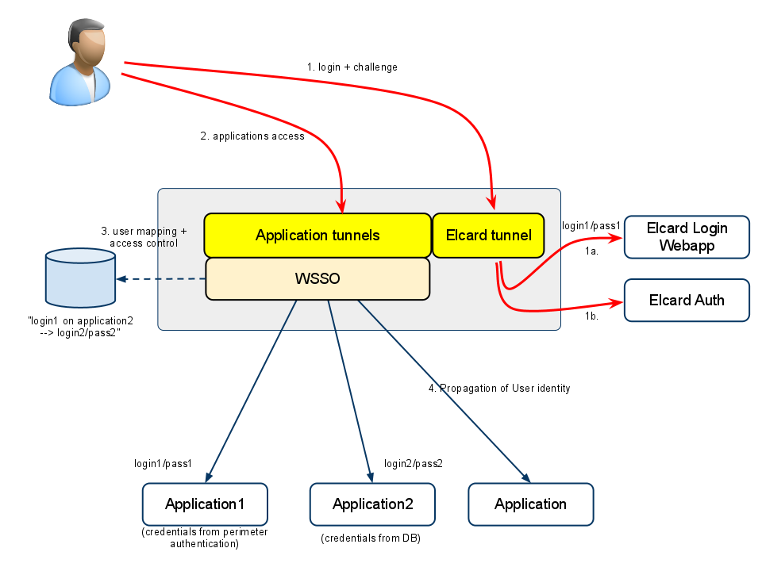
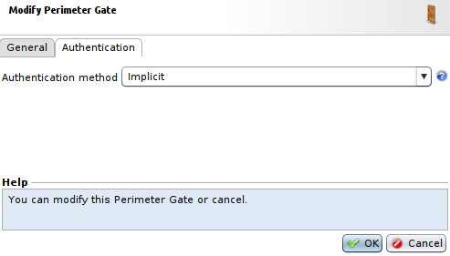
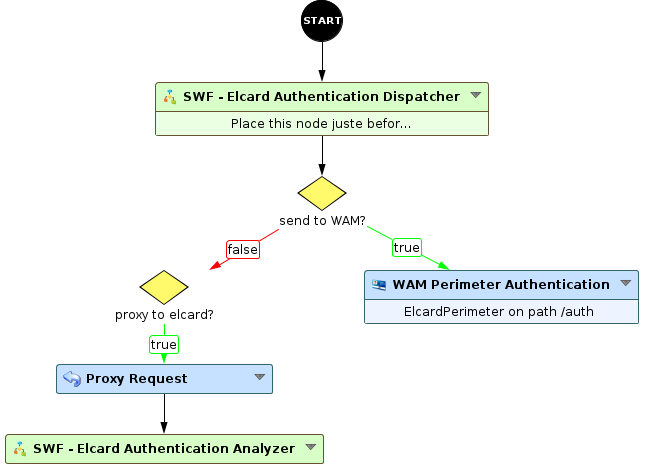
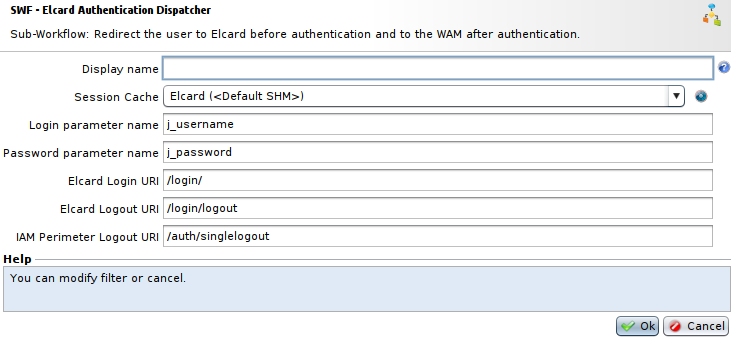
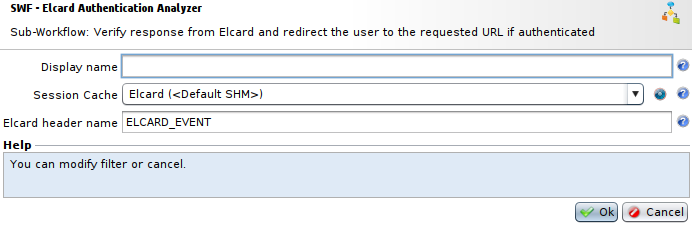

Configuring Elcard authentication
=================================

* 1 [Presentation](#presentation)
* 2 [Backup](#backup)
* 3 [Light integration](#light-integration)
    * 3.1 [Proxification of the Elcard server](#proxification-of-the-elcard-server)
    * 3.2 [Implicit Perimeter Gate](#implicit-perimeter-gate)
    * 3.3 [Logout management](#logout-management)
    * 3.4 [Workflow](#workflow)
        * 3.4.1 [SWF - Elcard Authentication Dispatcher](#swf-elcard-authentication-dispatcher)
        * 3.4.2 [SWF - Elcard Authentication Analyzer](#swf-elcard-authentication-analyzer)
        * 3.4.3 [WAM Perimeter Authentication](#wam-perimeter-authentication)
        * 3.4.4 [Proxification of the application to be protected](#proxification-of-the-application-to-be-protected)
    * 3.5 [Elcard server settings](#elcard-server-settings)
* 4 [Integration with login support](#integration-with-login-support)

Presentation
------------

This use case presents how to configure and use authentication with Elcard. There are two possible methods for integrating an Elcard server into a Box: the light method and the method with login support.

Backup
------

The Workflow example can be found here : [WF - Elcard authentication](./backup/WF%20-%20Elcard%20authentication.backup)

Light integration
-----------------

Elcard authentication, broken down into two stages (login and challenge), is entirely managed by the Elcard server in this case. The exchanges between the user and the Elcard server transit via the WAF, which analyzes the Elcard server’s responses to determine a user’s authenticity.

In this case the WAM part provides only the SSO and access rights functions.

* The user accesses, or is redirected, to the Elcard authentication (with the login and the challenge) via a Tunnel. When the login and password are posted by the user, they are stored in temporary memory on the Elcard Tunnel. The **Authenticated** status is confirmed via analysis of the Elcard Auth responses by the Elcard Tunnel.
* The user then accesses, or is redirected to, the applications. The previously stored login and password are sent to the Gate for possible re-use for SSO.
* Access rights are verified and the login/password associated with the user for the different applications to be accessed are recovered.
* The authentication data is sent to the applications.

### Proxification of the Elcard server

In the first phase, a Tunnel must be created to proxify requests to the Elcard server. We recommend using a dedicated Tunnel.

After verifying that the authentication on the Elcard server is performed correctly through the Reverse Proxy, we can move to the next stage.

### Implicit Perimeter Gate

To configure the SSO function, a **Perimeter Gate** with the Authentication type of **Implicit** is necessary for recovering the login and password used during Elcard login and sending it to any protected applications.

You can create this gate by going to **Policies > WAM > Perimeter Gates** and pressing **Add**.

With this method, the login function is handled by the WAM, and only the challenge is handled by Elcard.

### Logout management

By default, a logout detected by the **WAM Application Access** nodes triggers a Single Logout at the level of the WAM engine. Redirection to Elcard logout is done through modification of the **Logout.jsp** page. The file below contains all the default JSPs, only the logout JSP is modified to perform a redirection to the Elcard logout URL (**/login/logout**) after a logout.

The new JSP archive is available here : [Elcard JSP archive](./backup/Elcard%20JSP.zip)

To upload this file and change the WAM, go to **Policies > WAM > Perimeter Gates**, click on the **Perimeter Gate** previously created, press **Customize > Displayed pages (JSP) > Upload JSP in a ZIP archive** and select the downloaded ZIP file.

When the logout is initiated from the Elcard application, the **SWF - Elcard Authentication Dispatcher** Sub-Workflow redirects first to the WAM logout, and finally to the Elcard logout.

### Workflow

Assign the **WF - Elcard Authentication** Workflow to the Tunnel created previously. This Workflow uses two Sub-Workflow, **SWF - Elcard Authentication Dispatcher** and **SWF - Elcard Authentication Analyzer**, to be placed before and after a **WAM Perimeter Authentication** node.

#### SWF - Elcard Authentication Dispatcher

The **SWF - Elcard Authentication Dispatcher** Sub-Workflow redirects the user toward the Elcard login/challenge applications when he has not been authenticated and towards the **WAM Perimeter Authentication** node once authenticated, for the SSO function. The node also analyzes requests to recover the user’s login and password to send them to the WAM engine when it is necessary to re-use the login/password for application authentication.

* The field **Session cache** allows to select a **non-Template** **Session Cache** to store user's information. This **Session Cache** should set the field **Path type** at **Root**.
* The field **Login parameter name** is the name of the form parameter containing the user's login, which will be recovered when he logs on to the Elcard login application. The default one is **j_username**.
* The field **Password parameter name** is the name of the form parameter containing the user’s password. The default one is **j_password**.
* The field **Elcard Login URI** represents the URI towards which the user is redirected when not authenticated. In this case it indicates the Elcard login application. By default, it is **/login/**.
* The field **Elcard Logout URI** represents the logout URI of the Elcard application. By default, it is **/login/logout**.
* The field **WAM Perimeter Logout URI** is the URL of the WAM perimeter logout towards which the user will be redirected when he logs out directly from the Elcard application. It is composed of the base path of the **WAM Perimeter Authentication** node with **/singlelogout** added at the end. So, the default value is **/auth/singlelogout**.

#### SWF - Elcard Authentication Analyzer

The **SWF - Elcard Authentication Analyzer** will verify the response from Elcard and if the user is authenticated, will redirect him to the requested URL.

* The field **Session cache** allows to select a **non-Template** **Session Cache** to store user's information. It has to be identical to the one chosen in the **SWF - Elcard Authentication Dispatcher** Sub-Workflow.
* The field **Elcard header name** allows to select the name of the header in which the user’s authenticated status is found. Default value is **ELCARD_EVENT**.

#### WAM Perimeter Authentication

The **WAM Perimeter Authentication** Sub-Workflow is the link between perimeter authentication and application authentication and SSO. You can find more information about it [here](./Setting%20up%20a%20perimeter%20authentication%20(SSO)).

In this case, this node should use the **Implicit** **Perimeter Gate** created previously. Also, the **Base path for this node** field is set at **/auth** by default, usually this path does not correspond with the start of a path used on the Elcard server, however if it does, another will need to be specified. This path serves as trigger for the node. Also, the **Session Cache** should be the same that these used in previous Sub-Workflows.

#### Proxification of the application to be protected

One or several tunnels must be created to protect applications. Integrating them with authentication is standard, for each application, an **WAM Application Access** node, which functions as an SSO agent, must be linked with the **WAM Perimeter Authentication** node.

If the internal portal function is enabled (with the **Show application in portal page** parameter, in conjunction with the **Activate Applications list on Portal page** setting of the **WAM Perimeter Authentication** node), the complete URL of the application must be specified in the **URL used in portal page** field. Enabling the portal lets you display the applications available to the user when he connects to the base URL of the **WAM Perimeter Authentication node** (**/auth/** by default).

### Elcard server settings

The **URLPieces** fields of the **WeaspConnector.properties** file and **back_url** of the **web.xml** file of the Web application must correspond to the URLs and Hostnames configured on the Tunnels.

Integration with login support
------------------------------

With this method, the login function is handled by the WAM, and only the challenge is handled by Elcard. An **Elcard** **Perimeter Gate** is necessary for that.

The Elcard application can be protected by a Tunnel, but this is not a prerequisite for authentication to operate, unlike the **Light** method.

* The user logs on to the WAM part.
* Once logged it, he is redirected to the Elcard authentication application and respond to the challenge via the card.
* Once authenticated, the user is automatically redirected to the requested application, the request contains security data sent by the Elcard application. These data are then verified by the Elcard Gate to authenticate the user.
* Access rights are verified and the login/password associated with the user for the different applications to be accessed are recovered.
* The authentication data is sent to the applications.
