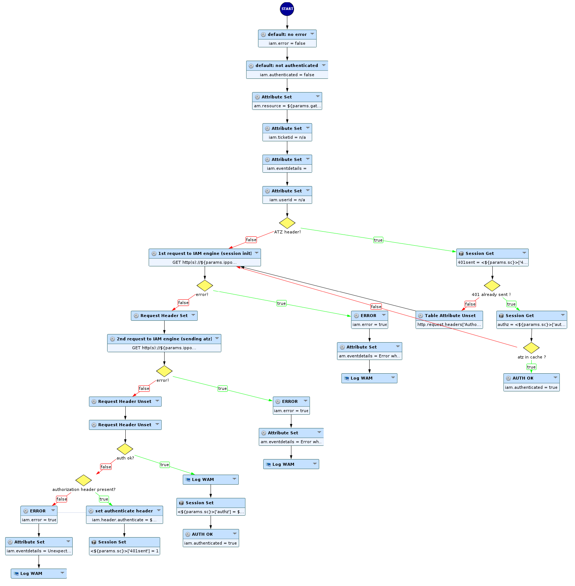
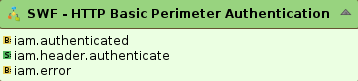
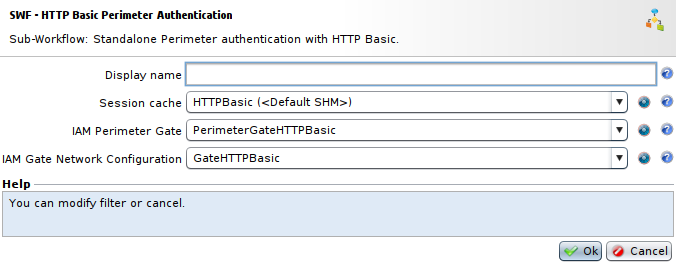
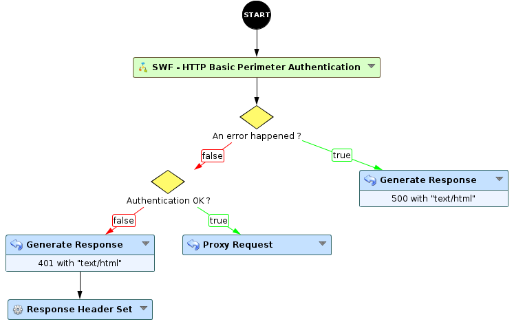

HTTP Basic authentication without redirection or JavaScript (with session)
==========================================================================

* 1 [Presentation](#presentation)
* 2 [Backup](#backup)
* 3 [SWF - HTTP Basic Perimeter Authentication](#swf-http-basic-perimeter-authentication)
    * 3.1 [Sub-Workflow](#sub-workflow)
    * 3.2 [Provided attributes](#provided-attributes)
    * 3.3 [Parameters](#parameters)
* 4 [Usage](#usage)
* 5 [Limitations](#limitations)
* 6 [Error cases](#error-cases)
    * 6.1 [Problem connecting to the WAM engine](#problem-connecting-to-the-wam-engine)
    * 6.2 [Problem with the WAM engine](#problem-with-the-wam-engine)

Presentation
------------

This use case will present you how to use the HTTP Basic authentication in your application without redirection or Javascript, this use case is based on the usage of Session Cache.

Backup
------

You can download the Sub-Workflow here: [SWF - HTTP Basic Perimeter Authentication](./backup/SWF%20-%20HTTP%20Basic%20Perimeter%20Authentication.backup).

SWF - HTTP Basic Perimeter Authentication
-----------------------------------------

### Sub-Workflow

This Sub-Workflow will simply check in the **Session Cache** if the user has already been logged in, if so, the user is connected and the Sub-Workflows ends.
Otherwise, it will send two subrequests to the **WAM Engine**, one to initialize the session and retrieve the **X-Session** header with session ID and the other subrequest to the **WAM Engine** with this **X-Session** header. Afterwards, we check the response of the second subrequest if the header **X-Auth-Status**, containing the response for the authentication, is present and begins with 0, indicating a successful authentication. In this case, we set in the Session Cache that the user has been authenticated, otherwise we put the value of the header **WWW-Authenticate** in the parameter **iam.header.authenticate** and indicate in the Session Cache that the 401 status code has been sent to the user.

### Provided attributes

* **iam.authenticated** is a boolean attribute that represents is the user has been authenticated or not.
* **iam.header.authenticate** is an attribute that represents the content of the **WWW-Authenticate** header, this header represents the authentication method used and the realm. 
* **iam.error** is a boolean representing if an error occured or not.

### Parameters

* The field **Session cache** is the **Session Cache** that will be used to store information about users authentication status.
* The field **WAM Perimeter gate** sets the **Perimeter Gate** to be used. The gate must be of **HTTP-Basic** type. Any type of authentication server can be used (RADIUS, LDAP, etc.).
* The field **WAM Gate Network Configuration** sets the IP/port connector to use when contacting the Gate, it must be configured in SSL only.

Usage
-----

For this use case, we will present you the minimum Workflow to use to make it work.

* Firstly, use the Sub-Workflow **SWF - HTTP Basic Perimeter Authentication** with the proper parameters: the **Session Cache**, the **Perimeter Gate** and the **Gate Network Configuration**.
* Then, we have to check the provided attribute **iam.error** to verify if an error occured. In case of an error, we can generate a response with the 500 status code with the **Generate Response** node. Otherwise, we continue in the Workflow.
* Next, we check the provided attribute **iam.authenticated** to know if the user was authenticated. If the user has been authenticated, we just use the **Proxy Request** node to send the request, or else we generate a response with the status code 401 and we use the **Response Header Set** node to add the header **WWW-Authenticate** with the value **${iam.header.authenticate}**.

Limitations
-----------

The node is incompatible with the following functions:

* Displaying the WAM portal page because it uses a HTTP basic authentication.
* Changing passwords, and more generally Password Policy.
* Limiting the number of attempts (the **Max authentication attempt** setting in the Gate). Using a **Request Limiter** node can deal with this problem.
* WAM authorization engine.
* Logout from the WAM Perimeter.

Error cases
-----------

When the **iam.error** attribute is **true**, an unexpected error has been raised. It can have two possible causes.

### Problem connecting to the WAM engine

* The message **Error while contacting WAM engine on ip:port** alert in the Tunnel’s logs. The node failed to contact the WAM server.
* Make sure that the listening interface of the gate is SSL, and that the WAM Gate Listener parameter is set to that interface.
* Ensure that the connection can be made between the Box that hosts the Tunnel and the Box where the WAM engine is (if they are different).

### Problem with the WAM engine

If there is an **Perimeter Authentication failed (Unexpected response from WAM engine. See iam.log for details.)** in the WAM Logs, the node contacted the WAM engine, but its response is not in the expected format.

* Make sure that the authentication type for the Gate is HTTP Basic.
* Look for any error in the **iam.log** file.
