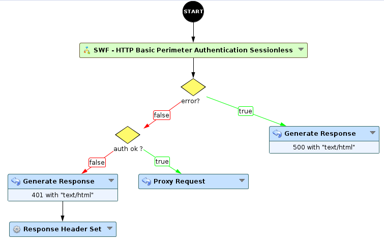
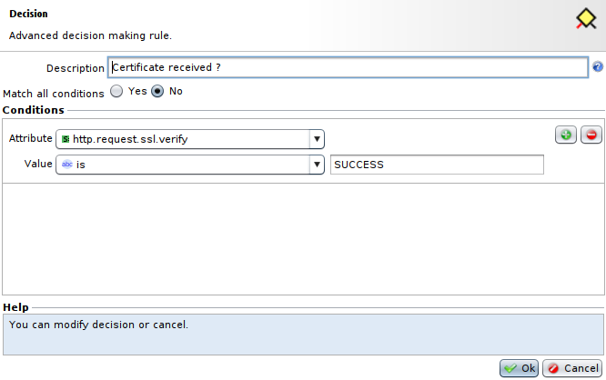
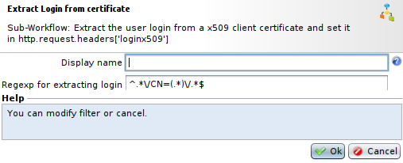
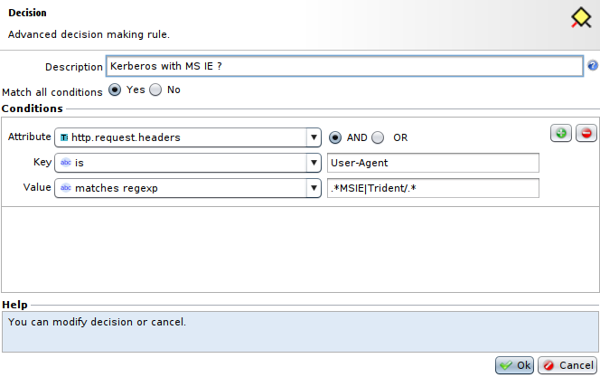

Implementation of perimeter authentication with multiple accesses
=================================================================

Presentation
------------

In this use case we are going to deal with the possibility to use multiple accesses to the perimeter authentication.

Backup
------

The example for this use case can be downloaded here : [WF - Multiple accesses to perimeter authentication](./backup/WF%20-%20Multiple%20accesses%20to%20Perimeter%20Authentication.backup).

|Note that the keytab bundle for Kerberos is not present in the backup file|
|--------------------------------------------------------------------------|

Usage
-----

### Description of the example

Here we will show you how to use specific accesses to perimeter authentication as an example : 
* Kerberos perimeter access. In this use case, Kerberos will be used with MS IE (Microsoft Internet Explorer) browsers because it has its internal TGT cache.
* Certificate access. You can check the usage of certificates for clients here : [Implementing SSL authentication using X509-PKI certificates](../../SSL%20and%20Confidentiality/Implementing%20SSL%20authentication%20using%20X509-PKI%20certificates).
* Access via form. This method is the default method.

Due to its lower security level, a form lowers the overall level of security, but allows third-party authentication.

### Prerequisites

For this use case, you will have to create a **Gate Network Configuration** and several **Perimeter Gate**, one for each type of access.

* To create the **Gate Network Configuration**, go to **Policies > WAM > Perimeter Gates > Gates Network Configurations**, press **Add**, select the proper parameters (Box, IP, port, SSL) and press **OK**.

* Then, to create the three **Perimeter Gate**, go  back to **Policies > WAM > Perimeter Gates**, press **Add**, select the **Gate Network Configuration** you have just created. And in the **Authentication** tab, you can select the authentication method that will be used.
	* For the Kerberos authentication, select **Kerberos**. In this case you will have to select a **Kerberos keytabs bundle**, you can create one from this menu but to modify it you will have to go to **Policies > WAM > Perimeter Gates > Kerberos Keytabs Bundles**
	* For the authentication with a certificate, select **Implicit** authentication.
	* And for the form authentication, select **form**. You can also change the maximum number of attempts allowed in the same tab, and in the **Authentication Backends** tab you can choose the **Authentication server type** and the **password policy**.

### Sub-Workflow

* First of all, a **decision** node will check if a certificate is present by checking if the **http.request.ssl.verify** has the value **SUCCESS**.

* Then, if the certificate is present, we will use the Sub-Workflow **Extract Login from certificate** to extract the login. The pattern to use in this Sub-Workflow is `^.*\/CN=(.*)\/.*$`. Afterwards, we use the **WAM Perimeter Authentication** node with the **Perimeter Gate** for authentication with certificate we have created earlier. We also use the path **\auth**, you can select another path if this one is already present in your application.

* If the certificate is absent, we use another **decision** node to check if we want to use Kerberos with MS IE. To do so, we will check if the **User-Agent** comes from an MS IE browser, for this we will check if the **User-Agent** header matches the regular expression `.*MSIE|Trident/.*`.

* Finally, if the browser used is MS IE, we will redirect the request to the **WAM Perimeter Authentication** using the **Perimeter Gate** for Kerberos authentication. We will also set the same path used for the previous **WAM Perimeter Authentication**. Otherwise, we will redirect the request to the **WAM Perimeter Authentication** using the **Perimeter Gate** for form authentication, still using the same path for this node.

| Note that you can use **WAM Application Access** node by linking it to any of these **WAM Perimeter Authentication**.|
|----------------------------------------------------------------------------------------------------------------------|
