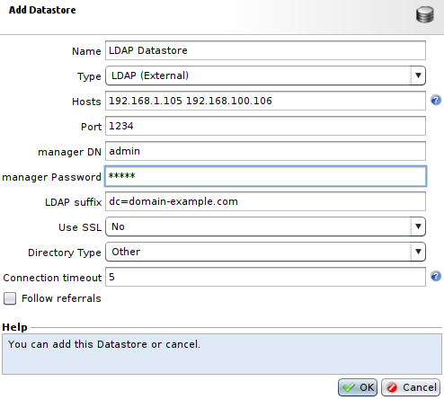
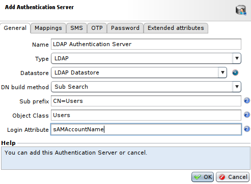
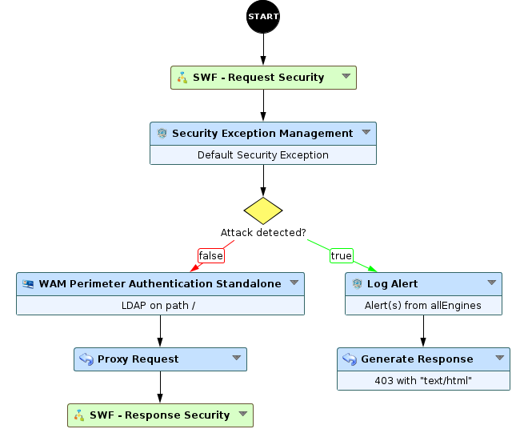

Implementing HTTP Basic Authentication with LDAP server
=======================================================

* 1 [Presentation](#presentation)
* 2 [Backup](#backup)
* 3 [Configuration](#configuration)
	* 3.1 [Datastore](#datastore)
	* 3.2 [Authentication Server](#authentication-server)
	* 3.3 [Perimeter Gate](#perimeter-gate)
	* 3.4 [Workflow](#workflow)

Presentation
------------

This use case presents how to setup HTTP Basic Authentication with an LDAP Active Directory server.

Backup
------

You can download the Workflow for LDAP example here: [WF - LDAP Authentication](./backup/WF%20-%20LDAP%20Authentication.backup)

Configuration
-------------

To perform this operation, we are going to insert an **WAM Perimeter Authentication Standalone** node into a Workflow to block the user until he is authenticated. We’ll use a **Perimeter Gate** to define the characteristics of the perimeter authentication (type of authentication, format of the messages sent to the user, etc).

The end result is that if a user tries to connect to the Web server, the connection transits through the Tunnel, which relays it to WAM. WAM polls the Active Directory and the latter either authorizes or refuses the connection to the Web server.

### Datastore

At first, we need to create a **Datastore LDAP**, for this part you will have to go to **Policies > Datastore**, press **Add**, select the **Type** value as **LDAP (External)** and select proper parameters for this Datastore. The Datastore object represents the basic characteristics of the server, without taking its function (authentication, credential storage, etc.) into consideration.

1. The field **Hosts** should contain IP or hostname to contact le LDAP server, you can use several IP or hostname by separating them with a space in this field. The field **Port** will simply contain the port to use to contact the server.
2. The fields **Manager DN** and **Manager Password** are used to indicate an account that has rights for searching and reading users’ attributes (DN manager), which enables us to retrieve the right DN for the user. In the specific case of Active Directory, and with the default settings, all users can perform a DN search. Since anonymous LDAP Binding is not available, a dedicated user should be chosen.
3. The field **LDAP suffix** is the common base of all the objects in the directory. Exemple: **dc=company.com**.

### Authentication Server

Then, we have to create the **Authentication Server**. To do so, go to **Policies > WAM > Perimeter Gates > Authentication Servers**, press **Add**, select **LDAP** and proper parameters.

For the **Type**, the value should be set at **LDAP** and the **Datastore** should use the **Datastore LDAP** we have previously created.

To retrieve the logins there are two possible methods here: 
1. If the login is contained in the DN and all users are in the same branch of the directory, in which case a Template can be used to determine the DN. And so, we will set the **DN build method** at the value **Template**.
2. Or, and this is generally the case with **Active Directory** directories, the login is not contained in the DN and a search must be made on the directory to find the DN that corresponds to the user’s login. In this case, we should use the **DN build method** as **Sub Search**.

In this case, we’ll use this last method **Sub search**, because in our example the login is in the **sAMAccountName** attribute.

The **Sub prefix** field represents the relative branch under which all the users are located. For example, if the user DNs are **CN=xxx,OR=Prod,CN=Users,DC=owa,DC=local** or **CN=xxx,OR=Integ,CN=Users,DC=owa,DC=local**, the common path is **CN=Users,DC=owa,DC=local**. Removing the LDAP global suffix from the directory **DC=owa,DC=local**, the **Sub prefix** for the search becomes **CN=Users**.

To search the user in the directory, a subrequest will then be sent via the path **CN=Users,DC=owa,DC=local**. We will also filter with the **Object Class** that should be set at **Users**, and with the **Login Attribute** set as **sAMAccountName**, which contains the user’s login.

### Perimeter Gate

Next we need to create a **Gate Network Configuration** and a **Perimeter Gate**. To do so, go to **Policies > WAM > Perimeter Gates > Gates Network Configurations**, press **Add** to create a **Gate Network Configuration** with proper parameters (Box, IP, port, etc).

Then, go back to **Policies > WAM > Perimeter Gates** for the **Perimeter Gate**. Select the previously created **Gate Network Configuration**, then in the **Authentication** tab select **HTTP-Basic**, and in the **Authentication Backends** select **LDAP** with your **LDAP Authentication server**.

### Workflow

Finally, to create or modify the Workflow used for this use case, go to **Policies > Workflow**. For this independent authentication, as opposed to authentication with SSO, we need to add an **WAM Perimeter Authentication Standalone** node to a Workflow. We’ll create a new Workflow for our example, but it is possible to insert this node into an existing Workflow.

Note that the **Base path for this node** field is not editable, so it means that the node will block any request that reaches it. To place an authentication only on a subpath, a **decision** node has to be added upstream to filter a specific path.
