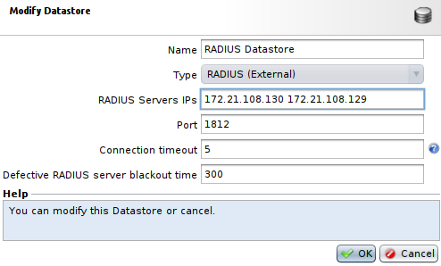
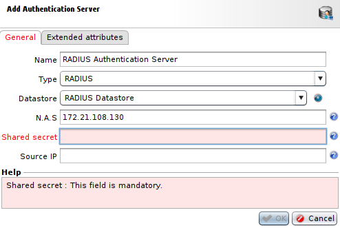
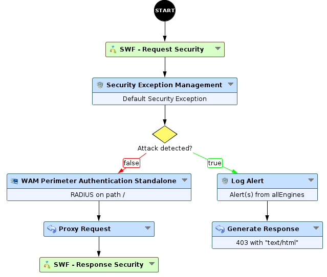

Implementing HTTP Basic Authentication with RADIUS server
=========================================================

* 1 [Presentation](#presentation)
* 2 [Backup](#backup)
* 3 [Configuration](#configuration)
	* 3.1 [Datastore](#datastore)
	* 3.2 [Authentication Server](#authentication-server)
	* 3.3 [Perimeter Gate](#perimeter-gate)
	* 3.4 [Session parameters](#session-parameters)
	* 3.5 [Workflow](#workflow)

Presentation
------------

This use case presents how to setup HTTP Basic Authentication with a RADIUS server.

Backup
------

You can download the Workflow for RADIUS example here: [WF - RADIUS Authentication](./backup/WF%20-%20Radius%20Authentication.backup)

Configuration
-------------

### Datastore

Firstly we need to create the **RADIUS Datastore**, to do so, you can go to **Policies > Datastores**, press **Add**, select **RADIUS (External)** and set proper parameters.

In the field **RADIUS Server IPs** you can select several IP addresses for reaching the RADIUS server and its redundancy servers.

### Authentication Server

Now, for the **Authentication Server**, go to **Policies > WAM > Perimeter Gates > Authentication Servers**, press **Add**, select **RADIUS** and proper parameters.

1. You have to set the field **Type** as **RADIUS** and select the previously created **RADIUS Datastore** in the **Datastore** field.
2. The field **N.A.S** (Network Access Server) is the IP or hostname of the Box hosting the WAM engine, it has to be declared as a client on the RADIUS server.
3. The field **Shared secret** should contain the secret exchanged between the WAF engine and the RADIUS server.

### Perimeter Gate

Next, we need to create a **Gate Network Configuration** and a **Perimeter Gate**. To do so, go to **Policies > WAM > Perimeter Gates > Gates Network Configurations**, press **Add** to create a **Gate Network Configuration** with proper parameters (Box, IP, port, etc). 

Then go back to **Policies > WAM > Perimeter Gates** for the **Perimeter Gate**. Select the previously created **Gate Network Configuration**, then in the **Authentication** tab select **HTTP-Basic**, and in the **Authentication Backends** select **RADIUS** with your **RADIUS Authentication server**.

### Session parameters

After that, we need to ceate a **Session Cache** for the **WAM Perimeter Authentication Standalone** using RADIUS to store information related to a user’s session using HTTP cookies. Only a random identifier is sent to the browser, while the needed data item is stored by the WAF. 

Before creating the **Session Cache**, we need to create a specific **Datastore** that will be used here. To do so, go to **Policies > Datastores**, press **Add** and set the field **Type** as **Shared Memory (Internal)**, you can use default values for other fields.

Now that we have the proper **Datastore**, we can create the **Session Cache**. To achieve this, go to **Policies > Workflows > Sessions Cache Profiles**, press **Add** and select appropriate parameters. We need to set the field **Datastore** with the Datastore we have just created, and leave the field **Path type** at **Root**, and other values at default ones.

### Workflow

Finally, to create or modify the Workflow used for this use case, go to **Policies > Workflow**. For this independent authentication, as opposed to authentication with SSO, we need to add an **WAM Perimeter Authentication Standalone** node to a Workflow. We’ll create a new Workflow for our example, but it is possible to insert this node into an existing Workflow.

Note that the **Base path for this node** field is not editable, so it means that the node will block any request that reaches it. To place an authentication only on a subpath, a **decision** node has to be added upstream to filter a specific path.
