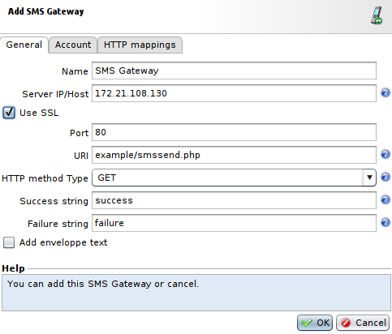
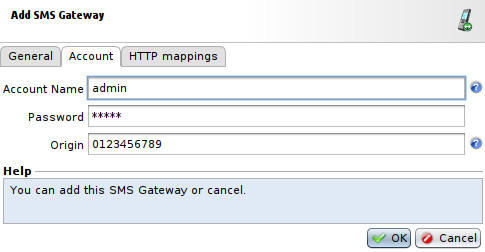
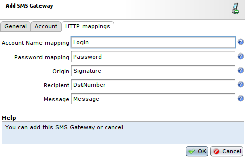
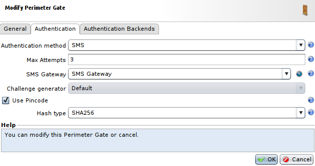
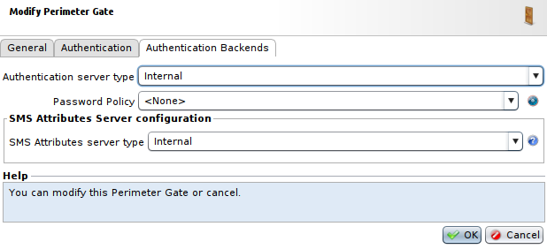
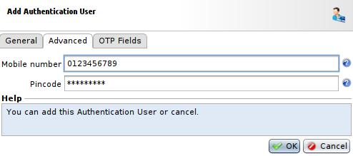
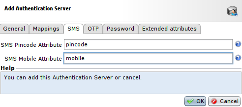
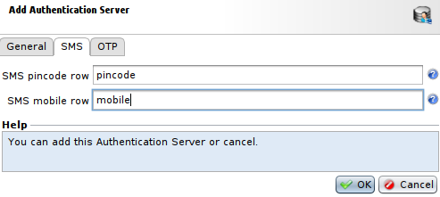

Implementing Multi-Factor Authentication using SMS
==================================================

* 1 [Presentation](#presentation)
* 2 [Configuring the SMS Gateway](#configuring-the-sms-gateway)
	* 2.1 [General tab](#general-tab)
	* 2.2 [Account tab](#account-tab)
	* 2.3 [HTTP mappings tab](#http-mappings-tab)
* 3 [Configuring the SMS Perimeter Gate](#configuring-the-sms-perimeter-gate)
	* 3.1 [Settings](#settings)
	* 3.2 [SMS Attributes Server](#sms-attributes-server)
		* 3.2.1 [Internal](#internal)
		* 3.2.2 [LDAP](#ldap)
		* 3.2.3 [MySQL](#mysql)

Presentation
------------

The WAF can implement a MFA (Multi-Factor Authentication) using SMS Gateways.

Two parallel, and totally impermeable, networks are used:

* The Internet, via which the user identifies herself and gives her response.
* The GSM network, via which the authentication server sends the challenge to the user.

Calling on two different channels to complete the authentication gives it a certain strength.

Configuring the SMS Gateway
---------------------------

To perform an authentication of this type, the **Authentication Server** must connect to an **SMS Gateway**. The role of this SMS Gateway is to send a challenge to the user in a formatted SMS message, via the GSM network. The OTP (One-Time Password) that is sent is 8 digits long. 

The SMS gateway is declared in the **SMS Gateways** panel that you can find at: **Policies > WAM > Perimeter Gates > SMS Gateways**. The parameters of an SMS Gateway are distributed over three tabs: **General**, **Account** and **HTTP mappings**.

### General tab

This is where the general parameters of the SMS Gateway (IP, Port, URL of the SMS sending service, etc.) are defined.

* The field **Server/IP Host** represents the IP address or the host of the SMS Gateway.
* The field **Use SSL** allows to select between using the SSL protocol or not.
* The field **Port** represents the port of the SMS Gateway.
* The field **URI** is the URI of the service sending the SMS.
* The field **HTTP Method Type** allows to select the method used to contact the SMS Gateway, POST or GET.
* The field **Success string** indicates a distinguishing string in the response from the SMS Gateway that indicates that the request to send an SMS message has been accepted. Example: **SMS sent successfully**. This string is generally provided to you by the operator of the SMS Gateway.
* The field **Failure string** indicates the same thing but with the failure case.
* The field **Add envelope text** lets you define a mask (header or footer) for the format of the message sent by the SMS Gateway.

### Account tab

This tab is where the fields related to the account opened with the SMS Gateway provider are located.

* The field **Account Name** is the name of the account used to contact the SMS Gateway.
* The field **Password** is the password used to contact the SMS Gateway.
* The field **Origin** is the caller ID, phone number or signature to include in the SMS.

### HTTP mappings tab

This is where the relation between the fields and parameters (POST or GET) of the SMS Gateway Web service is set up. Most of the data to be entered in the fields on this tab are generally supplied by the operator of the SMS Gateway.

* The field **Account Name mapping** is the name of the HTTP parameter to use to transmit the login.
* The field **Password mapping** is the name of the HTTP parameter to use to transmit the password.
* The field **Origin** is the name of the HTTP parameter to use to transmit the **Origin** that we chose in the **Account** tab.
* The field **Recipient** is the name of the HTTP parameter to use to transmit the recipient phone number.
* The field **Message** is the name of the HTTP parameter to use to transmit the effective message.

Configuring the SMS Perimeter Gate
----------------------------------

### Settings

To configure the **WAM Perimeter Gate** with the **SMS Gateway**, go to **Policies > WAM > Perimeter Gates**. Then, select the **Perimeter Gate** you want to modify or create one from this menu. 

In the **Authentication** tab:

* The field **Authentication method** should be set at **SMS**.
* The field **SMS Gateway** should contain the **SMS Gateway** we have just created.
* The field **Use Pincode** is a boolean allowing to select if we want to use a PIN code or not. The PIN code (user secret) is concatenated with the challenge received via SMS and the result is encrypted with MD5/SHA1, then sent to WAM. Using a PIN code (similar to the OTP PIN with OTP authentication) strengthens SMS Gateway authentication.
* The field **Hash type** is the encryption of the challenge, it can be **SHA256**, **MD5** or **SHA1**. You should select **SHA256**, the other encryptions are now insecure.

In the **Authentication Backends** tab:

* The field **Authentication server type** allows to select the type of server used to process to the authentication. It can be: **Internal**, **LDAP**, **RADIUS**, **PostgreSQL** or **MySQL**.
* The field **SMS Attributes Server** is the type of server used to retrieve PIN code and number. It can be **Internal**, **LDAP** or **MySQL**.

### SMS Attributes Server

#### Internal

To use the internal datastore for storing users’ mobile number and PIN code, select **Internal** in the field **SMS Attributes Server**. The mobile number and PIN code can then be configured on the user form. For this, go to **Policies > WAM > Internal Store**, select the **Box** that will be used and press **Add** to create an user. In this menu, go to the **Advanced** tab to add **Mobile Number** and **Pincode**.

#### LDAP

To use an LDAP directory for storing the mobile number and PIN code, select **LDAP** in the field **SMS Attributes Server**. Then, then choose or create an element in the **Authentication Server** that appears under **LDAP**.

The fields **SMS Pincode Attribute** and **SMS Mobile Attribute** of the **SMS** tab of the Authentication Server used must be filled in. The **SMS Pincode Attribute** and **SMS Mobile Attribute** fields designate the LDAP attributes used for storing users’ PIN code and mobile number, respectively. The attributes must be of string type and must be mono-valued.

|Note that when an LDAP directory is used for storing mobile numbers and PIN codes, the **Mobile number** and **Pincode** fields (located in **WAM > Internal Store > Users > Advanced**) of the WAM user forms are not used, and can’t be used to modify the corresponding attributes of the LDAP directory.|
|----------------------------------------------------------------------------------------------------------------------------------------------|

#### MySQL

To use **MySQL** to store the mobile number and PIN code, select **MySQL** in the field **SMS Attributes Server**. Then, then choose or create an element in the **Authentication Server** that appears under **MySQL**.

The fields **SMS Pincode Attribute** and **SMS Mobile Attribute** of the **SMS** tab of the Authentication Server used must be filled in. The **SMS pincode row** and **SMS mobile row** fields designate the MySQL rows used for storing users’ PIN code and mobile number, respectively.

