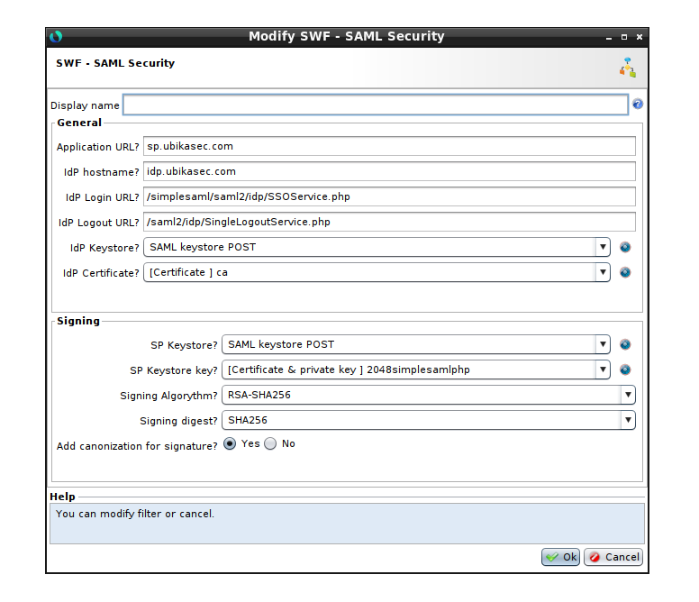

# SAMLv2 integration

Use cases:

* A: [Implementing a SAMLv2 Service Provider (pack 2.0.1)](./pack_v2/Implementing-a-SAMLv2-Service-Provider.md)
* B: [Connecting to a SAMLv2 Service Provider (pack 2.0.1)](./pack_v2/Connecting-to-a-SAMLv2-Service-Provider.md)

Backups:

* [SAML-pack-3.0.backup](./attachments/SAML-pack-3.0.backup)
* (deprecated) [SAML-pack-2.0.1.backup](./attachments/SAML-pack-2.0.1.backup)
* (deprecated) [SAML-pack-2.0.1-Samples.backup](./attachments/SAML-pack-2.0.1-Samples.backup)

In all cases, an **Extended API security license is required**. In certain implementations (Connecting to a SAMLv2 Service Provider), the **WAM license is also required**.

**For the integration or any need of improvements, please contact our Service team.**

## SAML pack 3.0

This use case requires the backups provided on SAML pack 3.0.

### Provided Sub-Workflows 

Sub-Workflows are the same than in SAML Pack 2.0.1:

* SAML: Parse assertion
* SAML: Verify assertion signature
* SAML: Decrypt assertion
* SAML: Check pending request if needed
* SAML: Verify dates assertion if needed
* SAML: Check date validity
* SAML: ZuluDateToTimestamp
* SAML: Decode assertion
* SAML: Send request to IdP
* SAML: Generate request
* SWF - SAML Security

### SWF - SAML Security

This is the main node that undercovers many sub workflows.

#### Parameters

* Application URL: main hostname for SP
* IdP hostname: IdP hostname to redirect for authentication
* Idp login url: path to handle login on IdP hostname
* Idp logouturl: path to handle logout on IdP hostname
* Idp keystore: keystore containing IdP certificate
* Idp certificate: Certificate for signature verification

#### Signing

* SP keystore: keystore containing SP private key (for signature)
* SP key: SP private key for signature
* Signing Algo: Signalture algorithm RSA (SHA-256 or SHA-512)
* Signing Digest: (SHA-256 or SHA-512)
* Canon for signature (ADFS): yes if ADFS IdP

### Limitations

Only HTTP POST method is supported.

SHA-1 is available on workflows BUT is deprecated since 6.11.

## SAML pack 2.0.1

The backup contains all the sub-workflows required to use SAML and an XML Namespaces profile.

After restoration, only items you have to use directly will be visible.

| Item | Type | Use case |
| --- | --- | --- |
| SAML: Parse assertion | Workflow | A   |
| SAML: Verify assertion signature | Workflow | A   |
| SAML: Decrypt assertion | Workflow | A   |
| SAML: Check pending request if needed | Workflow | A   |
| SAML: Verify dates assertion if needed | Workflow | A   |
| SAML: Check date validity | Workflow | A   |
| SAML: ZuluDateToTimestamp | Workflow | A   |
| SAML: Decode assertion | Workflow | A   |
| SAML: Send request to IdP | Workflow | A   |
| SAML: Generate request | Workflow | A   |
| SAMLv2 namespaces | XML Namespace profile | A + B |
| SAML: Artifact generator | Workflow | B   |
| SAML: Artifact resolver | Workflow | B   |
| SAMLv2 - HTTP Redirect + Artifact | Workflow | B   |
| SAML: Logout service | Workflow | B   |

## SAML pack 2.0.1 - Samples

This backup contains sample configuration showing to show how to use the SAML pack.

* The restoration of tunnel is not required for use case A, only the workflow is important.
* The content of keystores is provided as example an must be replaced by you own keys.
* Some items are present in backup only to simplify restoration procedure for use case B (Box, Reverse proxy, Device and IP Address). 

| Item | Type | Use case |
| --- | --- | --- |
| Test tunnel SAMLv2 SP Binding HTTP Post | Tunnel | A   |
| Sample: SAMLv2 SP Binding HTTP Post | Workflow | A   |
| SAML keystore POST | Keystore | A   |
| Test tunnel SAMLv2 SP Binding HTTP Redirect | Tunnel | A   |
| Sample: SAMLv2 SP Binding HTTP Redirect | Workflow | A   |
| SAML keystore REDIRECT | Keystore | A   |
| SAMLSessions | Session cache profile | A + B |
| Test tunnel SAMLv2 IdP Binding HTTP Redirect + Artifact | Tunnel | B   |
| Sample: SAMLv2 IdP Binding HTTP Redirect + Artifact | Workflow | B   |
| SAML keystore ARTIFACT | Keystore | B   |
| SAMLTransferService | Application (WAM) | B   |
| InternalPerimeterLoginPass | Perimeter Gate (WAM) | B   |
| GateConnector | Gate Network Configuration (WAM) | B   |
| Management | Box | B   |
| Rp1 | Reverse proxy | B   |
| eth0 | Network device | B   |
| eth0 - eth0 | IP address | B   |

## Release note

v1.5.3:

* WF-1: Bad handling of timezone on day change
* WF-2: Provide HTTP Responses in "SAML: Send request to IdP"
* WF-3: Add "AssertionConsumerServiceURL" attribute in assertion if and only if ACS URL is filled in

v1.5.4:

* WF-7: Add "Extensions" XML node in assertion if and only if Extension is filled in
* WF-8: Add the Destination XML attribute in assertion if the message is signed
* WF-9: Use of UTC time in IssueInstant attribute

v1.5.5:

* WF-10: Improvement in XML Signature Verify and keystore
* WF-12: Check signature tag presence in assertion. If not found, check signature in encrypted datas

v1.5.6:

* WF-13: NameID not handled in "SAML: Generate Request"
* WF-14: Add forceAuthn parameter in "SAML: Generate Request"

v2.0.0:

* WAF-2481: SAML pack update for ADFS2 compatibility
* WAF-2157: SAMLV2 SP with parameterizable Digest and Algorithm parameters
* WAF-2628: SAML: Ability to parse assertions in both body and query
* WAF-1609: SAML: Decode assertion - no warning logs if xml.get.encrypted.table\['EncryptedAssertion'\] is not set
* WAF-1608: SAML: Decode assertion needs to use the http.request.port-dst
* WAF-706: SAML Pack: NotBefore/NotAfter malfunction

v2.0.1:

* WAF-3951: SAML Pack, auth bypass by sending an unsigned SAML response

v3.0:

* Logout: Logout part is no more delegated to a specific SWF (2.0.1 was "Logout Service") but embedded in "SAML: Request" SWF.
* Metadata (static) management: need to insert base64 cert.
