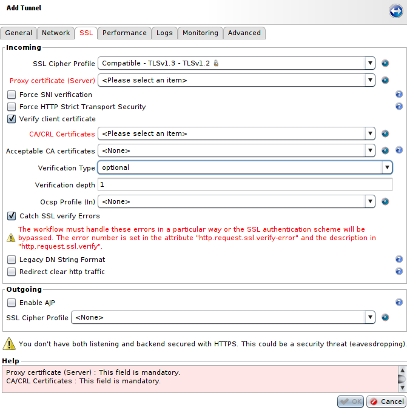
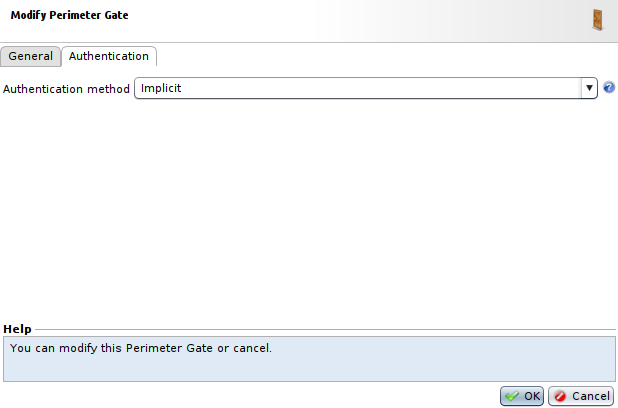
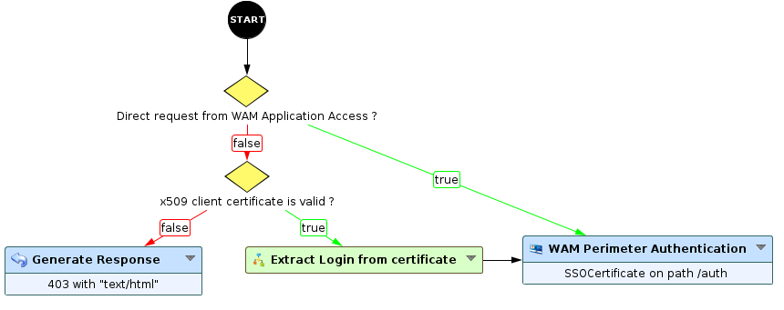
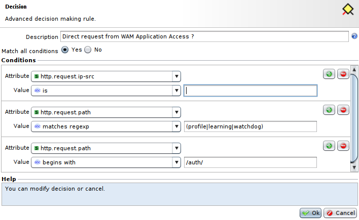
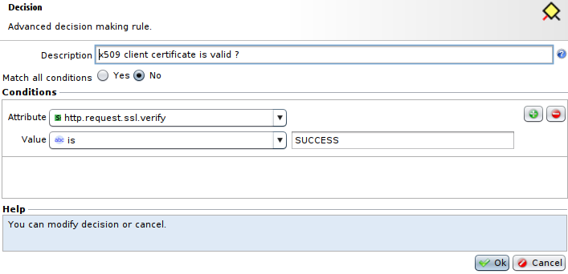
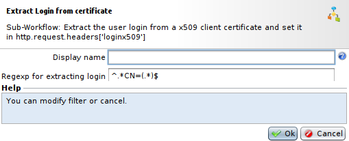

SSO: Implementing strong authentication using X509-PKI certificates
===================================================================

* 1 [Presentation](#presentation)
* 2 [Backup](#backup)
* 3 [Tunnel Configuration](#tunnel-configuration)
* 4 [Perimeter Gate](#perimeter-gate)
* 5 [Workflow](#workflow)

Presentation
------------

This use case explains how to configure x509 client authentication combined with Web SSO. For more information about SSL Authentication, you can go here: [Implementing SSL authentication using X509-PKI certificates](../../SSL%20and%20Confidentiality/Implementing%20SSL%20authentication%20using%20X509-PKI%20certificates)

Backup
------

You can download the backup for the Workflow here: [WF - SSO Authentication with certificates](./backup/WF%20-%20SSO%20Authentication%20with%20certificates.backup)

Tunnel Configuration
--------------------

Firstly, we will start by creating a Tunnel, from the **Applications** menu, to proxify the client request to the server. For this use case, we will have to modify some parameters in the **SSL** tab:

* The parameter **Verify client certificate** must be checked to allow the verification of the certificate and the authentication.
* The **Verification Type** parameter has to be set as **optional**, in order to verify x509 authentication at the level of the Workflow, and not at the level of the Tunnel.
* You should also check the **Catch SSL verify Errors** parameters to deal with errors inside the Workflow and not in the Tunnel.

Perimeter Gate
--------------

Then, we will create a **Gate Network Configuration** and a **Perimeter Gate** using **Implicit Authentication**. For this, go to **Policies > WAM > Perimeter Gates > Gates Network Configurations**, press **Add**, select appropriate parameters (Box, IP, port, etc) and press **OK**. 

For the **Perimeter Gate**, go back to **Policies > WAM > Perimeter Gates**, press **Add**, select the previously created **Gate Network Configuration** and in the **Authentication** tab, set the **Authentication method** at **Implicit** and press **OK**. 

Workflow
--------

Finally, we need to create a Workflow for our Tunnel that will use the **WAM Authentication Perimeter** to authenticate clients based on the certificates. To do so, go to **Policies > Workflows**, press **Add**, select a **Name** and press **OK**.

* The first decision labelled **Direct request from WAM Application Access ?** is needed to deal with direct requests coming from the **WAM Application Access** node (even if the latter is also located on the same Workflow/Tunnel), because the **WAM Application Access** node does not send an x509 client certificate.

* So, this **decision** node will check if the access comes from an **WAM Application Access** node or from a direct access to the base path **/auth**. To do so, it will simply verify **http.request.ip-src** and **http.request.path**.

|:warning: Note that you will have to put the IP address of the Tunnel containg the WAM Application Access node in the first condition about the attribute http.request.ip-src of this decision node|
|----------------------------------------|

* If it's a direct access from an **WAM Application Access** node, the request will be directly sent to the **WAM Authentication Perimeter** using the **Gate Network Configuration** and the **Perimeter Gate** with the **Implicit** authentincation method we have created before. Otherwise, we sent the request on another **decision** node.

* This **decision** node will check the attribute **http.request.ssl.verify** est à **SUCCESS** to verify if the certificate is present and correct, if so, we extract login from the certificate with the Sub-Workflow **Extract login from certificate** using the following regex: `^.*CN=(.*)$`. Then, we send this login to the **WAM Authentication Perimeter** node.

* If not, we simply send a **403 Forbidden** response with the **Generate Response** node.

Now, you can set this Workflow on the tunnel configured earlier and **Apply** every changes we have made.
