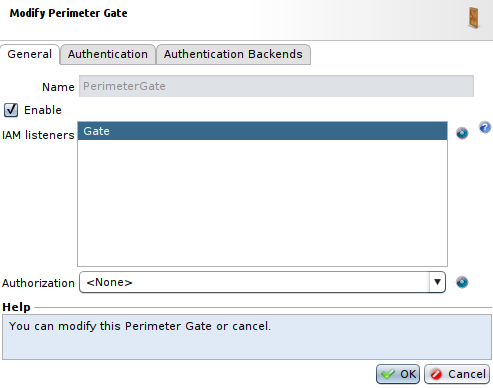
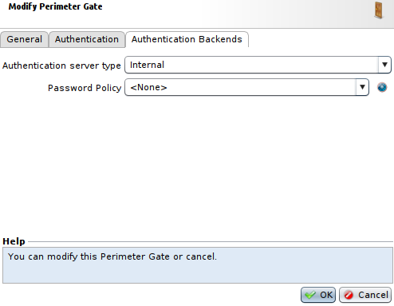
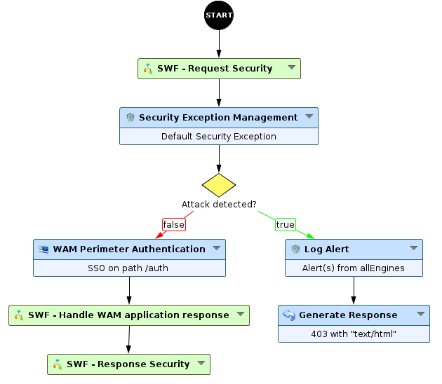
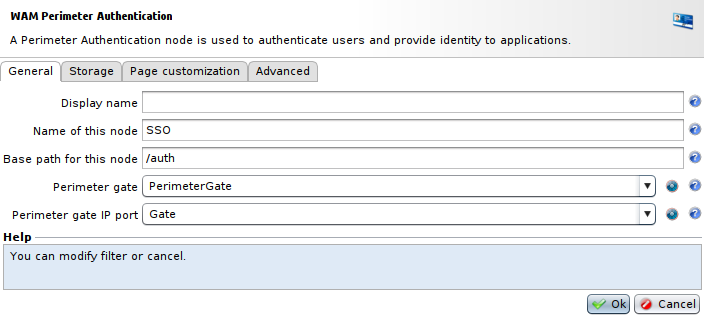
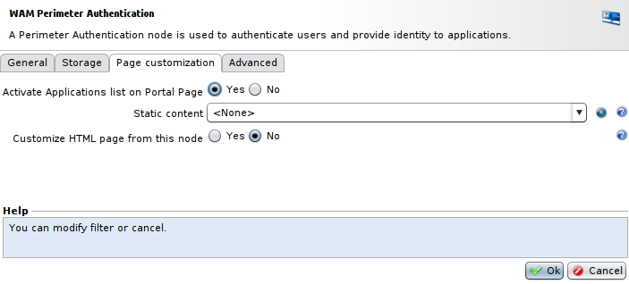
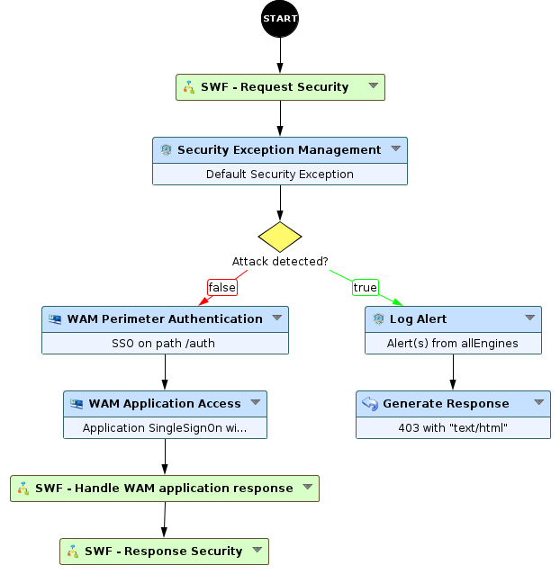
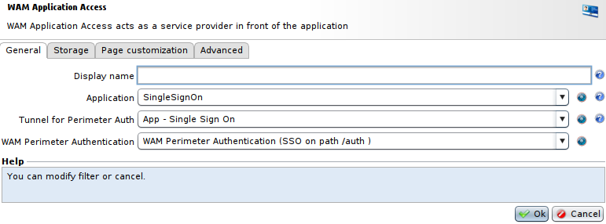
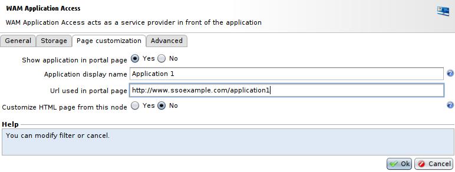
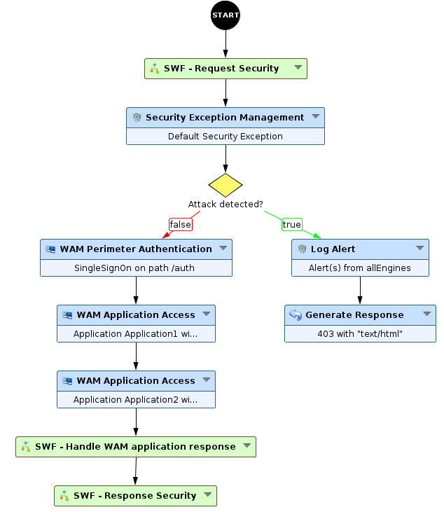

Setting up a SSO portal with different applications
===================================================

* 1 [Presentation](#presentation)
* 2 [Perimeter Gate](#perimeter-gate)
* 3 [Workflow](#workflow)
	* 3.1 [Setup the WAM Perimeter Authentication](#setup-the-wam-perimeter-authentication)
* 4 [Application](#application)
* 5 [WAM Application Access](#wam-application-access)
* 6 [Displaying multiple applications in the portal](#displaying-multiple-applications-in-the-portal)

Presentation
------------

This use case presents how to provide a Portal which will list the different applications that are accessible following the perimeter authentication. This configuration requires the WAM module.

Perimeter gate
--------------

First of all, we need to create a **Perimeter Gate** for the WAM, to do so:

* Go to **Policies > WAM > Perimeter Gate**.
* Click **Add** to create one, choose a **Name** and select a **Gate Network Configuration** for the **IAM listeners** field. You can select an existing one or create one from this menu using proper network parameters (Box, IP address, port).

* And, in the **Authentication Backend** we will use **internal** as our **Authentication server type** for more simplicity in this example.

Workflow
--------

To implement perimeter authentication in the Workflow, we will have to use the **WAM Perimeter Authentication** node. For this, add this node to your workflow. For this example we will use **WAF Default** as our starting Workflow and we will replace **Proxy Request** node with the **WAM Perimeter Authentication** node.

### Setup the WAM Perimeter Authentication

For the configuration of the **WAM Perimeter Authentication** node:

* In the **General** tab, select the usual parameters for the WAM: a **path** for the Authentication page, the **Perimeter Gate** and the **Gate Network Configuration**.

* In the **Page customization** tab, set the **Activate Applications list on Portal Page** at **Yes**.

Application
-----------

Then, we have to create an **Application**, to do so:
* Go to the **Policies > WAM > Applications** menu.
* Click **Add**, select a **Name** for the application.
* In the **Authentication Type** tab, you select the authentication type corresponding to your application. Here we will use **- no application auth -**.
* And in the **Logout** tab, choose a **Logout URI**, for example: **/logout**.

WAM Application Access
----------------------

Now, we need to add the **WAM Application Access** node to our previously created Workflow, we will add it after the **WAM Perimeter Authentication**.
To setup the **WAM Perimeter Authentication** node, you'll have to:

* In the **General** tab, select the **Application** we have just created.
* Select the **Tunnel** where the **WAM Perimeter Authentication** is located.
* And select the **WAM Perimeter Authentication** that will be linked to this **WAM Application Access** node.

* In the **Page customization** tab, set **Show application in portal page** at **Yes**.
* Then, add the **Name** that will be displayed for this application, and the **URL** that will be used in the portal page.

Displaying multiple applications in the portal
----------------------------------------------

Most of the time, you will have your other applications in different tunnels. In this case, to display multiple applications in the portal page, you will simply have to add the **WAM Application Access** node, linked to the **WAM Perimeter Authentication** you want to use for these applications, to the Workflow used by these tunnels.

However, if you want to add them in one tunnel, you can use as many **WAM Application Access** nodes in your Workflow as you have applications, you could chain these nodes like shown below:

In both cases, the web page showing the list of your applications will look like this:

