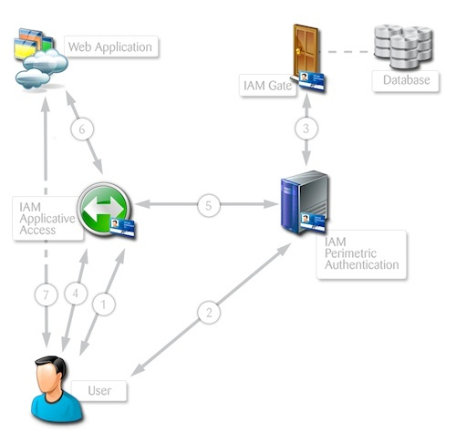
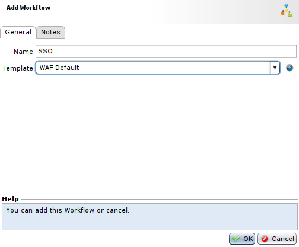
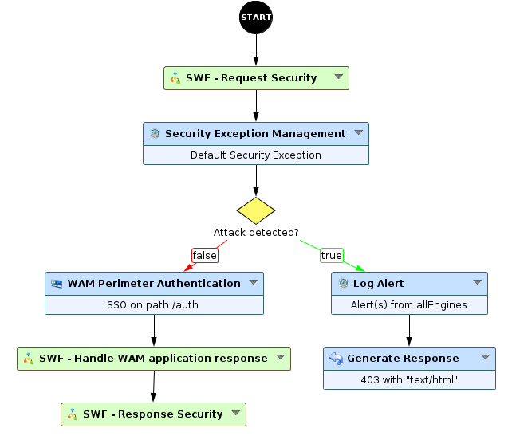
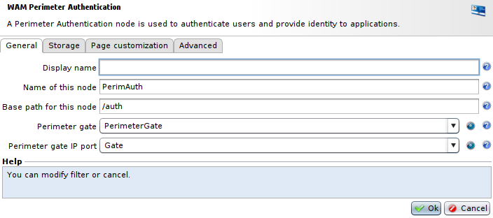
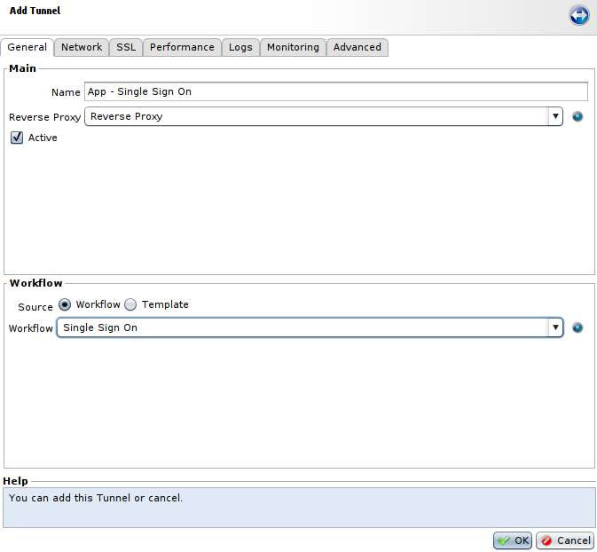
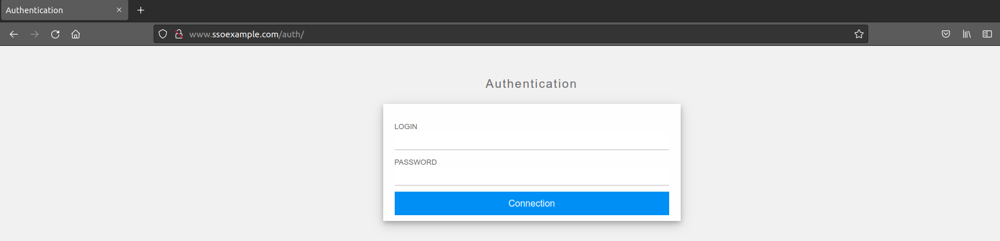
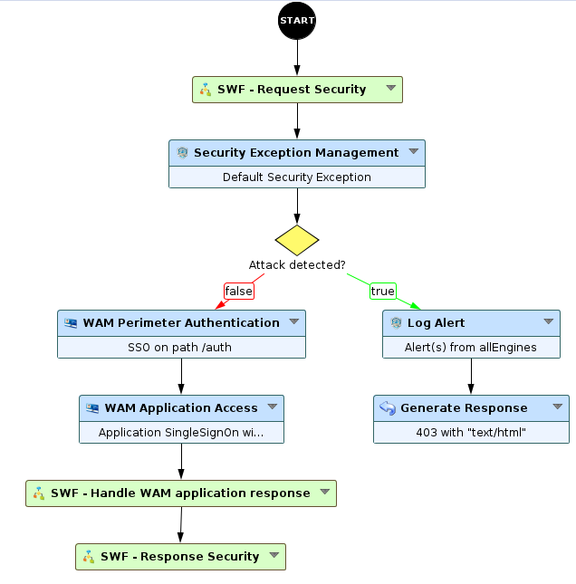

Setting up a perimeter authentication (SSO)
===========================================

* 1 [Presentation](#presentation)
* 2 [Positioning of perimeter authentication](#positioning-of-perimeter-authentication)
	* 2.1 [Single-host environment](#single-host-environment)
	* 2.2 [Multi-host environment](#multi-host-environment)
* 3 [Perimeter authentication](#perimeter-authentication)
* 4 [Propagating credentials to the application](#propagating-credentials-to-the-application)
* 5 [Tunnel and Workflow](#tunnel-and-workflow)
* 6 [WAM Application Access](#wam-application-access)

Presentation
------------

The WAM module is dedicated to managing and securing authentications on the Web. An agent-free solution that does not impact existing applications, it can transparently replace weak application authentication by a robust, centralized alternative chosen by the administrator. The solution, applied to several applications, gives the user all the benefits of Single Sign On.

This use case describes the minimum system requirements for application authentication using perimeter authentication, the foundation of Web SSO. The mechanism is put in place by associating several **WAM Application Access** components with the same **WAM Perimeter Authentication** component.

These components are nodes placed in the different Workflows of the tunnels.

Each Web application is then protected by a **WAM Application Access** component, which is referenced to a **WAM Perimeter Authentication** component which handles the single perimeter authentication.

All of the **WAM Application Access** components are linked to a single **WAM Perimeter Authentication** component that then handle the Single Sign-On function. The user is authenticated only once through the **WAM Perimeter Authentication** component, which sends the needed information to the **WAM Application Access** components for them to authenticate the user for their respective applications.

The authentication and SSO sequence are modeled on the SAML operation, the **WAM Application Access** component plays the role of Service Provider (SP) and the **WAM Perimeter Authentication** component that of Identity Provider (IdP):

* A user attempts to access the application. The **WAM Application Access** component intercepts the request and sends the user to the **WAM Perimeter Authentication** component to be authenticated.
* The user authenticates.
* Once the user has been authenticated, the **WAM Perimeter Authentication** component sends the user to the application.
* The user accesses the application again, this time with a ticket generated by the **WAM PerimeterAuthentication** component.
* The **WAM Application Access** component intercepts the request and verifies the validity of the ticket with the **WAM Perimeter Authentication** component and recovers the application authentication data (login, password, etc.)
* The **WAM Application Access** component authenticates the user to the application (by sending credentials in the format expected by the application) and sends the Web server’s response to the user.
* The user can then access the application normally.

In our examples, we use the same device to deploy the different components, but it is possible – and recommended (especially in a production environment) – to place the Workflows containing **WAM Application Access** and **WAM Perimeter Authentication** components on a “Frontal” Box and the WAM Gates (and any account datastores) on an Box protected within a specialized DMZ.

Positioning of perimeter authentication
---------------------------------------

Perimeter authentication is a service, accessible at a single address. This address must therefore be determined beforehand to suit the need. There are several possible cases, depending on the hostnames and domains of the applications to be integrated into Web SSO.

### Single-host environment

If a single host is used (example **www.mycompany.com**) for all the applications, they are probably accessible via different paths (e.g. ~ **http://www.mycompany.com/appli1/** ~ **http://www.mycompany.com/appli2/**, etc.)

In this case, a single Tunnel is used, and thus a single Workflow, and the different **WAM Perimeter Authentication** and **WAM Application Access** nodes will all be positioned on this same Workflow.

Therefore a new path that does not correspond to the existing URL must be decided on to be associated with the **WAM Perimeter Authentication** node, and it will be the sole entry point for perimeter authentication – for example **/auth/**, so the URL will be **http://www.mycompany.com/auth**.

### Multi-host environment

In this type of case, it has to be determined which host will support the authentication service.

An existing host already used for an application can be chosen, or a new host dedicated to the authentication service can be created.

In the first case, as in a single-host environment, a dedicated path must be chosen for the authentication service. Users accessing the different applications on different hosts will then be redirected to that URL for authentication.

In the second case, the authentication service can be on the root of the host created for the purpose.

In the rest of this document, we’ll use the example of a single-host environment to simplify the configuration.

Perimeter authentication
------------------------

Perimeter authentication is also called Primary Authentication. This function is handled by a group of components:

The user’s request is handled at the level of the Workflow by the **WAM Perimeter Authentication** node, which contacts the WAM Gate of the WAM engine, where an Authentication Server (LDAP, RADIUS, etc.) is polled to validate or reject the authentication.

A Gate defines all the parameters for perimeter authentication, such as the type of authentication, the associated server(s), the passwords policies and the type of presentation.

To create a Gate, we have to: 

* Go to **Policies > WAM > Perimeter Gate > Gates Network Configuration**
* Click **Add** to create a **Gate Network Configuration**, and select a **Name**, a **Box**, an **IP address** and a **port**. Default port is 8443. And it must not be directly accessible by a user.
* Then, go back to **Policies > WAM > Perimeter Gate**, and click **Add** to create the Gate. You will have to choose a name and select the previously created **Gate Network Configuration** on the **IAM listeners** field.

Propagating credentials to the application
------------------------------------------

The **Applications** item lets you define the characteristics of an authentication to an application – that is, the way in which the user’s credentials are sent to the application. To create one application:

* Go to **Policies > WAM > Applications** and press **Add**.
* You will have to choose a **Name** for the application. In the **Authentication Type** tab you're able to select an authentication type for your application, and so you will need to adapt it depending on the application.
* In the **logout** tab, you have to select an URI for logout, for example: **/logout**.

Tunnel and Workflow
-------------------

Prior to setting up SSO, it is imperative that you make sure that the Tunnels are correctly configured and that the target application operates properly through the Reverse Proxy.

Once the Tunnel or Tunnels are in place, you can associate a dedicated Workflow that will contain the WAM nodes, among others.

To keep the same security mechanism, the simplest approach is to create a new Workflow in **Policies > Workflows** using the template **WAF Default**.

In place of the **Proxy Request** node, we’re going to place a **WAM Perimeter Authentication** node followed by a **SWF - Handle WAM Application response** Sub-Workflow, which will provide a perimeter authentication in liaison with the Gate we created and the possibility to handle WAM response to secure it.

We will now configure the **WAM Perimeter Authentication** node:

* In the **General** tab, select a **Name** for this node.
* The field **Base path for this node** will contain the path of the **WAM Perimeter Authentication**, you can let default value **/auth** if this path doesn't already exist in your application.
* The field **Perimeter Gate** should contain the **Perimeter Gate** we previously created.
* The field **Perimeter gate IP port** should contain the **Gate Network Configuration** we previously created.

Then we have to modify the Tunnel so that it uses our new Workflow:

Perform an **Apply** for the **WAM** and the **Tunnel**. Now we can check whether access to the **/auth/** URL (the path associated with the **WAM Perimeter Authentication** node) via the tunnel triggers display of the WAM authentication prompt:

This simple test checks whether the Tunnel, the Workflow, the **WAM Perimeter Authentication** node and the Gate are configured to work correctly together. If you try to connect as a valid user, the portal page of accessible applications is presented, but with no applications.

WAM Application Access
----------------------

Now, we’ll position a node to protect the application and authenticate the user if he tries to get any page from your application. Because, for now, the **WAM Perimeter Authentication** node is only used when the user gets to the path **/auth**, and can have access to any other page without authentication.

For this we will add the **WAM Application Access** node to our Workflow to block access to the application as long as the **WAM Perimeter Authentication** has not been carried out, and to handle sending the user’s credentials to the application transparently, in liaison with the application we defined earlier.

Note that the **WAM Application Access** node we will add could be positioned after the **WAM Perimeter Authentication** node, which is valid since the **WAM Perimeter Authentication** node listens only on the **/auth** path and does not handle other requests. We could also have separated the two nodes with a decision on the path, or placed them on different Workflows and different tunnels.

Here, we will place it right after the **WAM Perimeter Authentication** node:

After that, we can **Save** the Workflow and **Apply** it. Finally, we can see that any attempt to access the application redirects the user to the URL pointing to the **WAM Perimeter Authentication** node to be authenticated.
