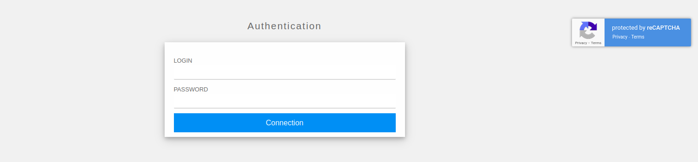
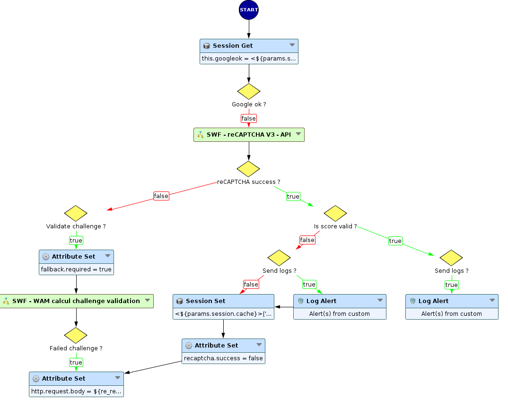
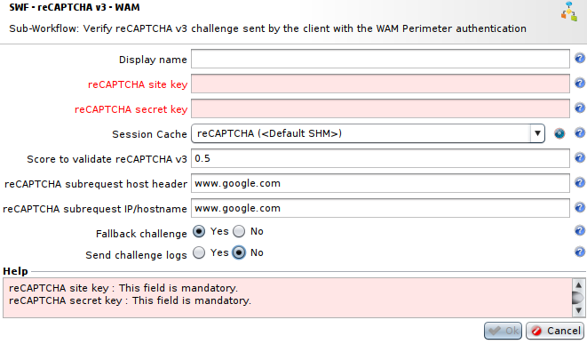
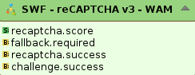
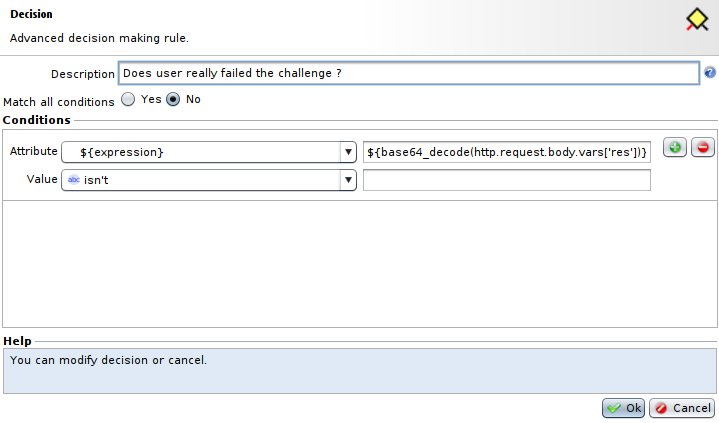
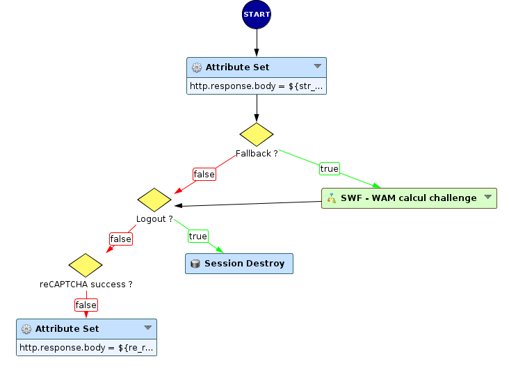
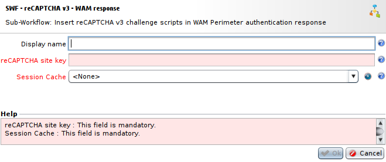

WAM Perimeter authentication with reCAPTCHA v3
==============================================

* 1 [Presentation](#presentation)
* 2 [Backup](#backup)
* 3 [Sub-Workflows](#sub-workflows)
	* 3.1 [SWF - reCAPTCHA v3 - WAM](#swf-recaptcha-v3-wam)
		* 3.1.1 [Settings](#settings)
		* 3.1.2 [Provided attributes](#provided-attributes)
	* 3.2 [SWF - reCAPTCHA v3 - WAM response](#swf-recaptcha-v3-wam-response)
		* 3.2.1 [Settings](#settings)
		* 3.2.2 [Provided attributes](#provided-attributes)
* 4 [Usage](#usage)
	* 4.1 [WAM setup](#wam-setup)
	* 4.2 [Workflow](#workflow)

Presentation
------------

This use case will present a way to add Google's reCAPTCHA v3 alongside with WAM authentication to add a verification of user's legitimacy based on reCAPTCHA score. It will allow you to select a score threshold that will make the authentication fail for users with a reCAPTCHA score lower than this threshold. It also includes the possibility to use a challenge as a replacement if Google's reCAPTCHA v3 services are not available.

You can find more information about Google's reCAPTCHA [here](https://www.google.com/recaptcha/about/).

Sub-Workflows using reCAPTCHA v3 need several prerequisites about Google's reCAPTCHA keys and DNS, you can find the documentation for these [here](../reCAPTCHA%20v3/README.md#prerequisites).

The WAM authentication page with the reCAPTCHA v3 logo and links to **Privacy Policy** and **Terms of Service** will look like this: 

Backup
------

Backup can be downloaded here: [SWF - reCAPTCHA v3 - WAM](./backup/SWF%20-%20reCAPTCHA%20v3%20-%20WAM.backup).

This backup contains several Sub-Workflows:
* **SWF - reCAPTCHA V3 - API**: this Sub-Workflow implements Google's reCAPTCHA v3 API, more information for this Sub-Workflow can be found [here](../reCAPTCHA%20v3/README.md#swf-recaptcha-v3-api).
* **SWF - reCAPTCHA v3 - WAM**: this Sub-Workflow setup the contact with reCAPTCHA services v3 with **SWF - reCAPTCHA V3 - API** and deal with the results of challenges.
* **SWF - reCAPTCHA v3 - WAM response**: this Sub-Workflow will modify the WAM Perimeter response page accordingly with reCAPTCHA's results.
* **SWF - WAM calcul challenge**: this Sub-Workflow is used to create the challenge in case of reCAPTCHA v3 services are unavailable.
* **SWF - WAM calcul challenge validation**: this Sub-Workflow is used to validate answer sent by user to the challenge.

This documentation will focus on the Sub-Workflows **SWF - reCAPTCHA - WAM** and **SWF - reCAPTCHA v3 - WAM response** as they are the ones that you will have to include directly to your Workflows.

Sub-Workflows
-------------

### SWF - reCAPTCHA v3 - WAM

As presented before, this Sub-Workflow is used to call reCAPTCHA v3 services and adapt behavior depending on results of reCAPTCHA v3.

This Sub-Workflow will imply the following behaviors depending on the reCAPTCHA:

* If an error occurs with reCAPTCHA v3 services and if the use of a fallback challenge is selected, the user will have to complete the challenge to authenticate. Then, depending if the user passes or fails the challenge, he will be able to validate his authentication or not.
* If the user fails the reCAPTCHA test due to a score lower than the threshold, the authentication will also fail.
* If the user has a score high enough and has a valid username/password, the user will be authenticated.

#### Settings

* The field **reCAPTCHA site key** will have to contain the reCAPTCHA's site key provided by Google for your domain names.
* The field **reCAPTCHA secret key** will have to contain the reCAPTCHA's secret key provided by Google for your domain names.
* The field **Session Cache** will contain the **Session Cache Profile** that will be used to store the data concerning users results for reCAPTCHA.
* The field **Score to validate reCAPTCHA v3**: this field will contain the score threshold that will force users with a reCAPTCHA score lower than this threshold to be blocked. This score ranges between 0 and 1.0, the lower it is the more likely it is to be a bot. The default value is 0.5. For more details about the score, see [interpreting the score](https://developers.google.com/recaptcha/docs/v3#interpreting_the_score).
* The field **reCAPTCHA subrequest host header** should contain the **Host** header for the subrequest made to check user's token. Default value is `www.google.com`.
* The field **reCAPTCHA subrequest IP/hostname** should contain the IP address or the hostname of the target for the subrequest made to check user's token. Default value is `www.google.com`.
* The field **Fallback challenge** is a boolean representing if a challenge has to be sent when reCAPTCHA services encountered a problem. The default value is **Yes**, if set to **No**, no challenge will be sent if an issue occurs during reCAPTCHA v3 and so the user will only connect with his login without any other test.
* The field **Send chalenge logs** is a boolean representing if logs have to be generated for each reCAPTCHA v3 or the calculation challenge result (success or fail). Default value is **No**.

#### Provided attributes

* **recaptcha.score** represents the reCAPTCHA score obtained by the user, it ranges between 0 and 1.0, the lower it is the more likely it is to be a bot. A decision can be taken on the client score to trigger actions (block, redirection, new challenge, ...).
* **fallback.required** represents if a fallback challenge needs to happen, this attribute is needed by **SWF - reCAPTCHA v3 - WAM response**.
* **recaptcha.success** is a boolean representing if the user ran through reCAPTCHA without error and if the user had a score higher or not than the score threshold passed with parameters. This attribute is also needed by **SWF - reCAPTCHA v3 - WAM response** to change the WAM authentication error message by the reCAPTCHA error.
* **challenge.success** is a boolean representing if the user passed the challenge or not. Note that this value can be `false` in different cases where there is no challenge sent. To ensure that client really fail the challenge, you could check if the challenge was sent using a **decision** node verifying the value ${base64_decode(http.request.body.vars['res'])}, like shown below.

### SWF - reCAPTCHA v3 - WAM response

This Sub-Workflow will be used to modify the WAM authentication to add the challenge if needed, delete **Session Cache Profile** content when logout and add reCAPTCHA error message if an issue occured during reCAPTCHA or if his score was lower than the threshold passed in parameters.

#### Settings

* The field **reCAPTCHA site key** will have to contain the reCAPTCHA's site key provided by Google for your domain names. 
* The field **Session Cache** will contain the **Session Cache Profile** that will be used to store the data concerning users results for reCAPTCHA. It has to be the same as the one selected in **SWF - reCAPTCHA v3 - WAM**.

Usage
-----

### WAM setup

First of all, as this use case presents a case with WAM, some WAM configuration is needed:

* Go to **Policies > WAM > Perimeter Gates > Gates Network Configurations**, press **Add** to create a **Gate Network Configuration** with proper configuration.
* Then, go back to **Policies > WAM > Perimeter Gates**, press **Add** to create a **Perimeter Gate** using the previously created **Gate Network Configuration**.
* Finally we need to stay on **Policies > WAM > Perimeter Gates** to select the **Perimeter Gate** we juste created, click on **Customize > Displayed Pages (JSP) > Upload JSP in a ZIP archive** and select the JSP archive created for reCAPTCHA v3 [here](./backup/reCAPTCHA%20v3%20JSP.zip). This pack contains a modified version the WAM Perimeter response page, allowing to insert challenges in the HTML page.

### Workflow

Finally, we will show you the minimal configuration to use **WAM** with **reCAPTCHA v3**:

Here we use the Sub-Workflow **SWF - reCAPTCHA v3 - WAM** with proper settings:
* Select both reCAPTCHA v3 keys provided by Google, **reCAPTCHA site key** and **reCAPTCHA secret key**.
* Select an already existing **Session Cache**, or create one from this menu.
* A score threshold between 0 and 1.0, blocking users with a score lower than this one.
* And finally, select between **Yes** and **No** for **Fallback challenge** and **Send logs**.

Then, we use a **WAM Perimeter Authentication** node to create the WAM Authentication, using **Gate Network Configuration** and **Perimeter Gate** created earlier and the same **Session cache** used in **SWF - reCAPTCHA v3 - WAM** parameters. We will also need to go to the **Advanced** tab and set **Always provide response** to **Yes**.

Next, use the **SWF - Handle WAM application response** Sub-Workflow to retrieve WAM response to modify it afterwards.

Lastly, use the **SWF - reCAPTCHA v3 - WAM response** Sub-Workflow with the same **reCAPTCHA site key** and **Session Cache** given to **SWF - reCAPTCHA v3 - WAM** Sub-Workflow.
