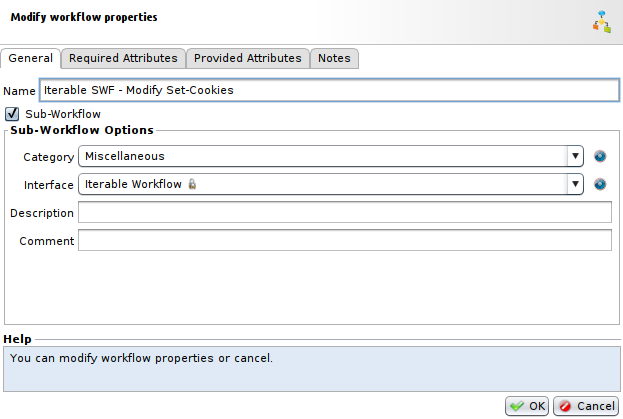
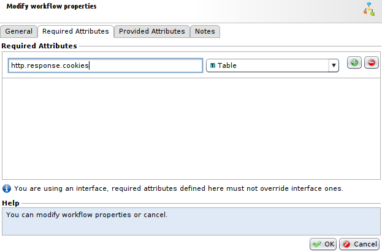
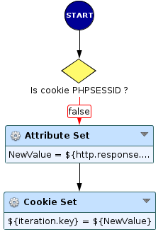
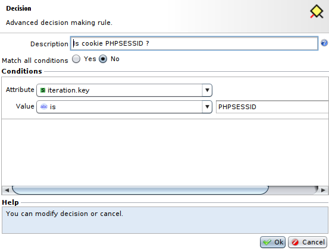
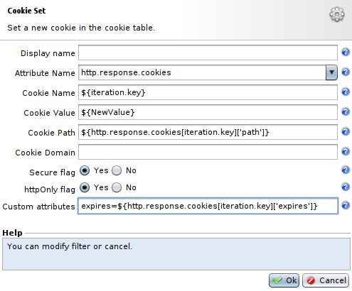
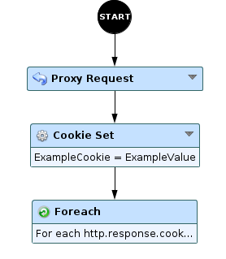
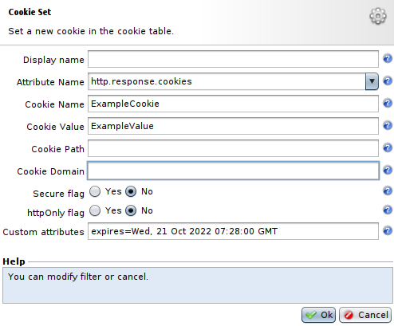
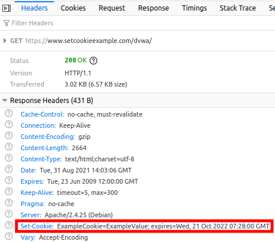
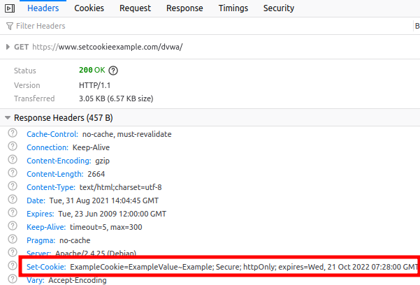

Foreach node to modify Set-Cookie
=================================

* 1 [Presentation](#presentation)
* 2 [Backup](#backup)
* 3 [Workflow](#workflow)
    * 3.1 [Create an Iterable Sub-Workflow](#create-an-iterable-sub-workflow)
    * 3.2 [Setup the Iterable Sub-Workflow](#setup-the-iterable-sub-workflow)
    * 3.3 [Create the Workflow using the Iterable Sub-Workflow](#create-the-workflow-using-the-iterable-sub-workflow)
* 4 [Results](#results)

Presentation
------------

This use case aims to illustrate the **Foreach** node and the **Iterable Sub-Workflow** usage to intercept and change Set-Cookie header sent by server.

Backup
------

You can download the Workflows for this example here: [Foreach node to modify Set-Cookie](./backup/Foreach%20node%20to%20modify%20Set-Cookie.backup)

Workflow
--------

### Create an Iterable Sub-Workflow

An Iterable Sub-Workflow allows to loop on the table contents. It means that each key/value of the table will be handled by this workflow from the first element to the last. 

We are going to create this **Iterable Sub-Workflow** by going to **Policies > Workflows** and press **Add** button. Then, set a name for your Workflow, tick the **Sub-Workflow** box and in the **Interface** field select **Iterable Sub-Workflow**.

You should also go to the **Required Attributes** tab, press **Add first element**, set its name at **http.response.cookies** and select the type **Table** for it.

Then, press **OK** to create the Sub-Workflow.

### Setup the Iterable Sub-Workflow

Now that we have an empty **Iterable Sub-Workflow**, we can complete it to intercept and modify the **Set-Cookie** header from the server's response with **Foreach** node.

In this example, we will simply modify **Set-Cookie** by adding **~Example** at the end of cookie's value. To do so:

* Firstly, we have added a **Decision** node to check if the cookie was **PHPSESSID**, which is a cookie allowing to identify users sessions, so we probably don't want to tamper with this cookie. To verify this, we check if the **iteration.key** attribute, that is the attribute representing the name of the cookie in the table we send to this Sub-Workflow, is **PHPSESSID**.

* Then, if the cookie is not **PHPSESSID**, we will create an attribute **NewValue** with **Attrbiute Set** node, the value will be **${http.response.cookies[${iteration.key}]['value']}~Example**, this value is composed of the previous **value** of the cookie represented by **iteration.key** and the part we are adding: **~Example**.
* Finally, we will use the **Cookie Set** node to modify the **Set-Cookie** header. We need to fill in the fields properly:
    * The field **Attribute Name** has to contain the **http.response.cookies** attribute, which will be the cookie table where we want to modify or add the cookie.
    * The field **Cookie Name** will contain the name of the cookie to add or modify, here it will be **${iteration.key}** to keep the previous name of the cookie and to modify it.
    * The field **Cookie Value** will contain the value of the cookie to add or modify, here it will be **${NewValue}**, the previously created attribute for the value.
    * The field **Cookie Path** will contain the new path of the cookie, here we will keep the existing **Path**. To do so, use the value **${http.response.cookies[iteration.key]['path']}**.
    * The field **Cookie Domain** will contain the new domain for the cookie, here we will leave it empty, so it will remove it from the cookie if this attribute already existed.
    * The fields **Secure flag** and **httpOnly flag** can be ticked to add the **Secure** and **httpOnly** flags to the cookie. Here we will tick both of them.
    * The field **Custom attributes** will represent the custom attributes you can add to your cookies. Here we will set the value **expires=${http.response.cookies[iteration.key]['expires']}** to keep the **expires** attribute of the original cookie.

Finally, the **Iterable Sub-Workflow** is ready to modify our **Set-Cookie**. We should now integrate it inside a Workflow.

### Create the Workflow using the Iterable Sub-Workflow

Now, we have to create another Workflow in **Policies > Workflow**. In this example we will not create a complete and complicated workflow but the minimum needed for this use case.

* Firstly, we have the **Proxy Request** node that send the request to the backend, and allow us to retrieve response information that we need from the backend, like **http.response.cookie**.
* Then, we have a **Cookie Set** node, this node is especially for our example and is not mandatory to modify **Set-Cookie**, it only allows us to show the results of the modifications on a known cookie. We will create a cookie in the **http.response.cookie** table, named **ExampleCookie** with a **value** of **ExampleValue**, without **Secure** flag nor **httpOnly** flag and with a **expires** attribute set at **Wed, 21 Oct 2022 07:28:00 GMT**.

* Lastly, we have the **Foreach** node that will call the **Iterable Sub-Workflow** we have previously created. For the field **Table** we will use the attribute **http.response.cooklines**, this attribute is a special attribute that represents the **http.response.cookies** table content, but instead of using a table of tables like **http.response.cookies**, it uses a table of strings that will represent the value and attributes of the cookies. It is needed, because table of tables can act inappropriately with **Foreach** node. And for the field **Iterable SubWorkflow**, you simply need to select the **Iterable Sub-Workflow** we have created earlier.

Finally, you can **Save** this Workflow, choose it for your Tunnel and **Apply** the changes.

Results
-------

After setting the Workflow in the Tunnel, we can try to get to the URL of our application and check if the cookie created in the response has been modified appropriately.

The screenshot below shows the Set-Cookie value without the **Foreach** node that modifies this header.

In the **Set-Cookie** header, we can see that the cookie we have created as an example is here with proper parameters (i.e. its **value** and the **expires** attribute).

Then, if we set the **Foreach** node calling the **Iterable Sub-Workflow** in our Workflow, we can see:

Finally, after modification on the Sub-Workflow, we can observe that the **Set-Cookie** header has the **value** of the original cookie with **~Example** added at the end, the flags **secure** and **httpOnly** have been added and the **expires** attribute is still present.
