# Have versionned ICX and worflow configurations

1. [Description](#description)
2. [How to do this for an ICX Configuration](#how-to-do-this-for-an-icx-configuration)
3. [How to do this for a Workflow](#how-to-do-this-for-a-Workflow)

# Description

As a WAF Admin, I want to manage versions of my security configuration, so that I can know at any moment the details of the security configuration I have applied on my managed even if I have waiting modifications on my current security configuration.

# How to do this for an ICX Configuration

## Create a security configuration and use it in your workflow

In Policies / Security / ICX Configurations: add a new ICX Configuration. Name it to understand that this one will be connected with your workflow. This will be the version where you will do all your modifications. We will call it `ICX current v3.36`.

Now go to Policies / Workflows / Select a workflow and open it: In your ICX Engine node, choose your new ICX Configuration `ICX current v3.36`.

## Make modifications on your security configuration

You can make every modification you need on your `ICX current v3.36` configuration. You can also upgrade your DSU and rename `ICX current v3.36` to add the DSU version for example : `ICX current v3.37`.

### Example: Upload to the last ICX Pattern Security Update.

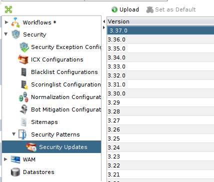
*I have uploaded the last ICX Pattern Security Update*

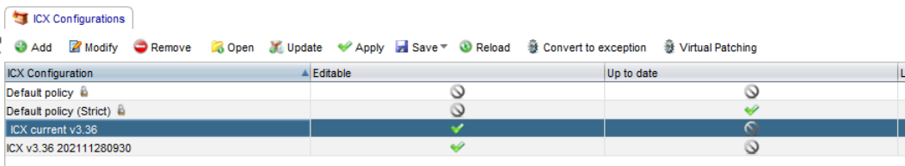
*My ICX configuration is not up to date anymore*

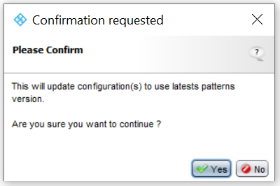
*I update my `ICX current v3.37` configuration*

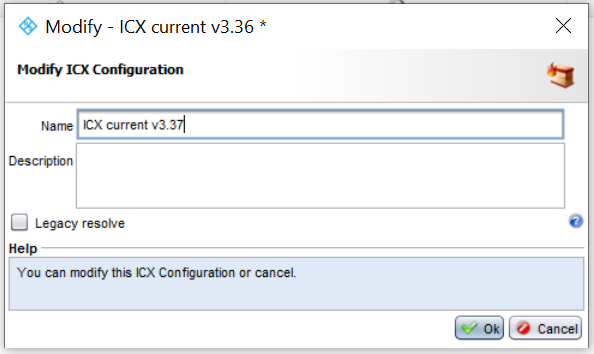
*I modify my `ICX current v3.37` configuration to change the name with the modifications I have just made*

*My `ICX current v3.37` configuration is now up to date*

## Apply your modifications

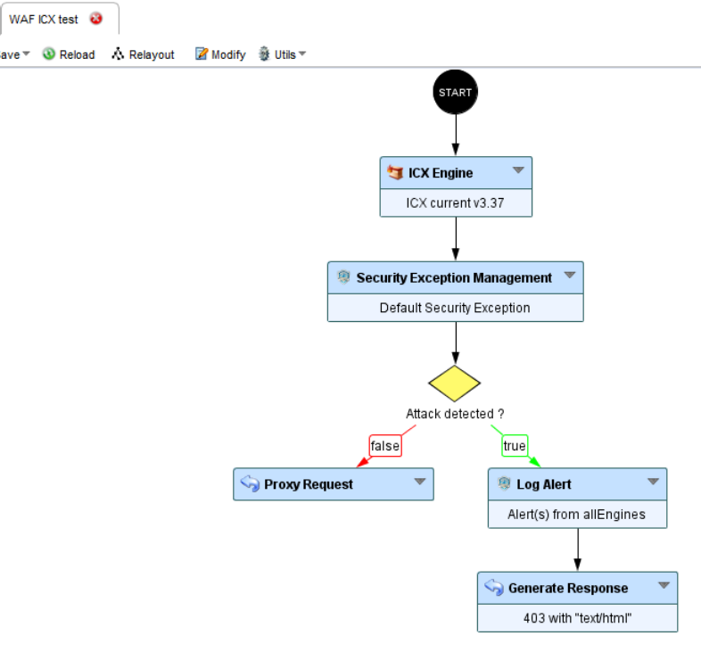
*Check: My workflow is using the `ICX current v3.37` configuration, the one on which I make my modifications*

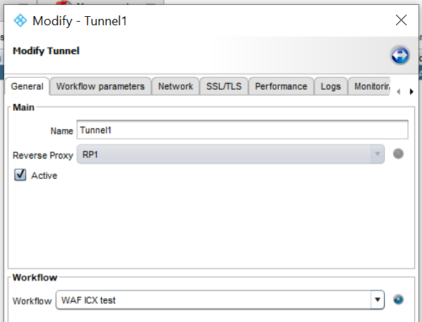
*Check: My tunnel is using the previous workflow*

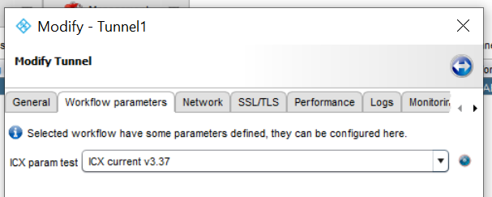
*Check: My `ICX current v3.37` configuration - the one with the latest modifications - is configured in my tunnel*

When your new configuration is ready, you can apply it.

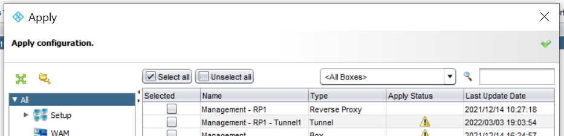
*I apply my new configuration*

Right after the apply and without doing any modification on `ICX current`, you have to create a copy of what you have just applied. So, Save as the `ICX current` and name it with some indicators such as: 

* DSU version,
* Day and time of the apply

For example: `ICX v3.37 202202241052`

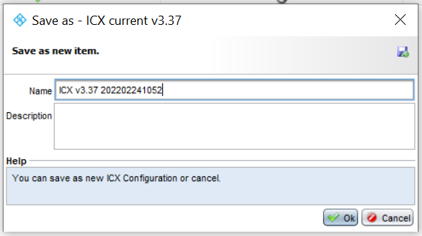
*I Save as the current configuration to create a version of my configuration on production*

This copy `ICX v3.37 202202241052` is your saved version of what you have applied in production

You can also add information in the Description field to indicate on which tunnel you applied this configuration for example.

> Advise: After saving each security configuration version, you should delete an old one to avoid having to many version along the time.

> Reminder: All the modifications has to be done on the configuration that is configured in the workflow you apply, not on the saved versions.

Now, you have saved versions of the security configuration you applied on production, and you will be able to check what modifications have been made since your last apply.

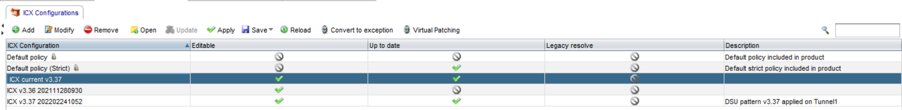
*I have my configuration saved versions and I know what I have applied*

# How to do this for a Workflow

You need to use the same process as for security configuration.

## Make modifications on your current workflow

You can make every modification you need on your current workflow. Change some nodes, change the configuration, etc.

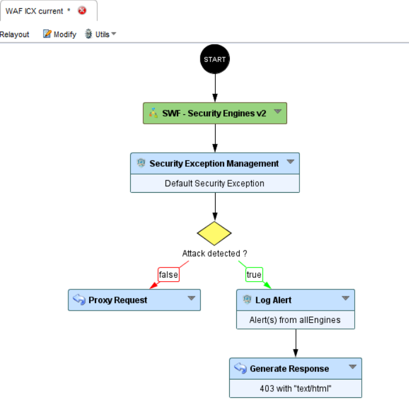
*In my current workflow, I changed the ICX engine by the Sub-Workflow `Security Engines v2`*

## Apply your modifications

When you have made all your changes, you can apply.

Right after the apply and without doing any modification on your workflow `WAF ICX current`, you have to create a copy of what you have just applied. So Save as the `WAF ICX current` and name it with some indicators.

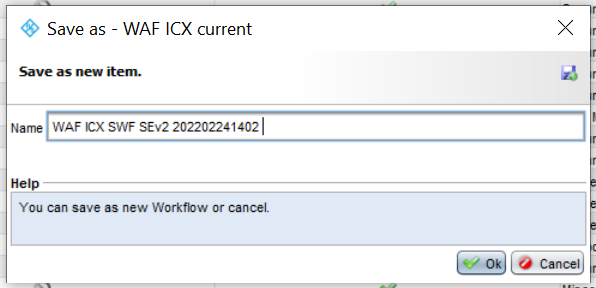

Now, you have a saved version of your workflow. And you can know what has been applied on production, and you will be able to check what modifications have been made since your last apply.