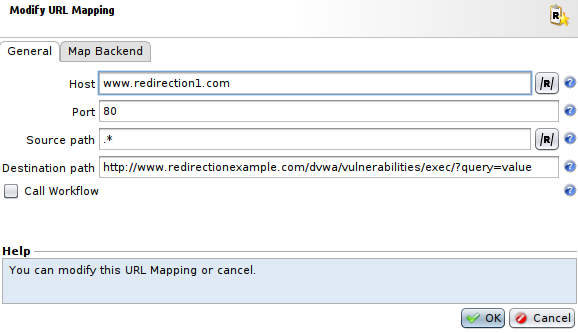

Redirect on FQDN
================

* 1 [Presentation](#presentation)
* 2 [Backup](#backup)
* 3 [Tunnel configuration](#tunnel-configuration)
* 4 [URL Mapping](#url-mapping)
    * 4.1 [URL Mapping profile](#url-mapping-profile)
    * 4.2 [URL Mapping rule](#url-mapping-rule)
* 5 [Workflow](#workflow)
* 6 [Result](#result)

Presentation
------------

This use case presents how to redirect clients depending on the **FQDN (Fully Qualified Domain Name)** being called, using URL Mapping. Therefore each FQDN will have to be present in the alias of the Tunnel. The destination can include a path and a query.

Backup
------

You can download the backup here: [WF - Redirect on FQDN](./backup/WF%20-%20Redirect%20on%20FQDN.backup).

Tunnel configuration
--------------------

Firstly, we need to add a **Server Alias** to the tunnel configuration for each FQDN we want to redirect to a specific page in your application.

For this, go to **Applications**, open your tunnel's settings, go to the **Network** tab and add FQDN to the **Server Alias** section.
In this example we will add one FQDN: **www.redirection1.com**.

URL Mapping
-----------

### URL Mapping profile

Then, we need to create an URL Mapping profile that will allow to select specific FQDN that will lead to automatic redirection in your application with path and parameters. 

To create the URL mapping: 
* Go to **Policies > Workflows > URL Mappings**.
* Press **Add** to create it, select a **Name** and press **OK**.

### URL Mapping rule

Now, select the newly created **URL Mapping** and in the view below press **Add** to add a rule to your **URL Mapping**. 

You will have to add proper parameters in the **General** tab for the **URL Mapping rule**:
* The field **Host** has to contain a regular expression representing the FQDN that will trigger the redirection. In this example we will use **www.redirection1.com**.
* The field **Port** has to contain the listening port of the tunnel, here **80**.
* The field **Source path** has to contain the a regular expression representing the path of the request. In this case we will set it at **.*** to match any path.
* The field **Destination path** should contain the destination path of the redirection. But for this use case we will use the complete URL of the desired redirection, in our example: **http://www.redirectionexample.com/dvwa/vulnerabilities/exec/?query=value**.

And you will also have to add proper parameters in the **Map Backend** tab for the **URL Mapping rule**:
* The field **Map Backend** needs to be ticked to allow modification.
* The fields **Destination** and **Port** will not be used in this use case, but are considered mandatory in this menu, so you can set dummy values like **0.0.0.0** and port **80**.
* The field **Host** has to contain the FQDN of the redirection URL, in this exemple we use **www.redirectionexample.com**.

Workflow
--------

The Workflow **WF - Redirect on FQDN** is mandatory to use the **URL Mapping profile** with your tunnel and to redirect the user accordingly.

First of all, this workflow will use the **URL Mapping** node with the **URL Mapping profile** we have just created to check if the **Host** and the **path** of the request match a rule in the **URL Mapping profile**. Note that this node will only use the first matching rule of the list.

Then, we check if any rule matched with the provided attribute **url.mapping.matched**. If so, we continue in the Workflow, otherwise we send the request to the backend.

Finally, it will check if the URL of redirection contains a query or not, and depending of it, it will use the **Redirect** node appropriately to redirect the request.

Result
------

Now, you can try to access to the URL triggering the redirection, in our example we used **www.redirection1.com**.

You can see that when we get to **www.redirection1.com** we have a redirection to the URL we set previously: **http://www.redirectionexample.com/dvwa/vulnerabilities/exec/?query=value**.
