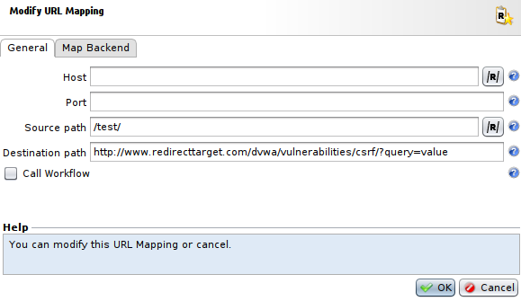
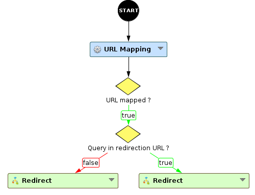

External redirect on Path
=========================

* 1 [Presentation](#presentation)
* 2 [Backup](#backup)
* 3 [URL Mapping](#url-mapping)
    * 3.1 [URL Mapping profile](#url-mapping-profile)
    * 3.2 [URL Mapping rule](#url-mapping-rule)
* 4 [Workflow](#workflow)
* 5 [Result](#result)

Presentation
------------

This use case presents how to redirect clients to URLs that are external from the tunnel depending on the **Path** being called, using URL Mapping. The destination can include a path and a query.

Backup
------

You can download the backup here: [WF - External redirect on Path](./backup/WF%20-%20External%20redirect%20on%20Path.backup).

URL Mapping
-----------

### URL Mapping profile

Then, we need to create an URL Mapping profile that will allow to select specific **Path** that will lead to automatic redirection to an URL external to your application with path and query. 

To create the URL mapping: 
* Go to **Policies > Workflows > URL Mappings**.
* Press **Add** to create it, select a **Name** and press **OK**.

### URL Mapping rule

Now, select the newly created **URL Mapping** and in the view below press **Add** to add a rule to your **URL Mapping**. 

You will have to add proper parameters in the **General** tab for the **URL Mapping rule**:
* The fields **Host** and **Port** have to be empty as they will not be used here.
* The field **Source path** has to contain a regular expression representing the path of the request. In this case we will set it at **/test/**.
* The field **Destination path** should contain the destination path of the redirection. But for this use case we will use the complete URL of the desired redirection, in our example: **http://www.redirecttarget.com/dvwa/vulnerabilities/csrf/?query=value**.

And you will also have to add proper parameters in the **Map Backend** tab for the **URL Mapping rule**:
* The field **Map Backend** needs to be ticked to allow modification.
* The fields **Destination** and **Port** will not be used in this use case, but are considered mandatory in this menu, so you can set dummy values like **0.0.0.0** and port **80**.
* The field **Host** has to contain the FQDN of the redirection URL, in this example we use **www.redirecttarget.com**.

Workflow
--------

The Workflow **WF - External redirect on FQDN** is mandatory to use the **URL Mapping profile** with your tunnel and to redirect the user accordingly.

First of all, this workflow will use the **URL Mapping** node with the **URL Mapping profile** we have just created to check if the **path** of the request matches a rule in the **URL Mapping profile**. Note that this node will only use the first matching rule of the list.

Then, we check if any rule matched with the provided attribute **url.mapping.matched**. If so, we continue in the Workflow, otherwise we send the request to the backend.

Finally, it will check if the URL of redirection contains a query or not, and depending on it, it will use the **Redirect** node appropriately to redirect the request.

Result
------

Now, you can try to access to the URL triggering the redirection, in our example we used **www.testredirection.com/test/**.

You can see that when we get to **www.testredirection.com/test/** we have a redirection to the URL we set previously: **http://www.redirecttarget.com/dvwa/vulnerabilities/csrf/?query=value**.
